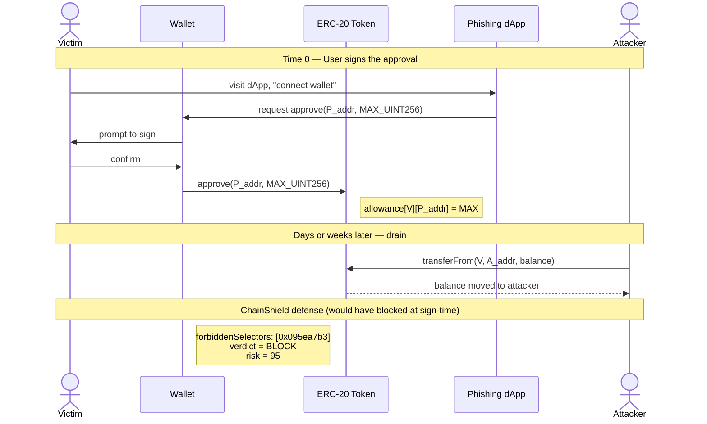

# erc20-attack-patterns

Reference for the most common ways treasuries and wallets lose ERC-20 funds, and which ChainShield rule blocks each.

## 1. Infinite approval drain

**What:** User signs `approve(spender, MAX_UINT256)`. Spender (often a phishing site, malicious contract, or compromised protocol) later calls `transferFrom(victim, attacker, balance)` to drain the entire balance. The original `approve` may have been signed years ago.

**Why it works:** ERC-20 approvals are persistent on-chain state. The user typically does not see them after signing. Wallets show the approval prompt without highlighting that the amount is unbounded.

**Engine defense:**

- `forbiddenSelectors: ["0x095ea7b3"]` blocks all `approve` calls.
- For protocols that need approvals, use `approvalCapByToken` to set a per-token ceiling. Anything above is blocked.
- Reasonable caps: 10x the user's typical interaction size, never `MAX_UINT256`.

**Detection signal in calldata:** the second 32-byte word equals `0xff...ff` (32 bytes of `f`).

## 2. Permit signature replay (ERC-2612)

**What:** A `permit(owner, spender, value, deadline, v, r, s)` signature, once signed off-chain, can be submitted by anyone to grant the spender allowance. Attacker tricks user into signing a permit (often disguised as a "free login" or wallet-connect step), then submits it themselves.

**Why it works:** Off-chain signing has no gas cost and feels harmless. Wallets may not display the spender or amount clearly.

**Engine defense:**

- The risk gate sees only on-chain calldata, so it cannot block the off-chain signature itself.
- It CAN block the `transferFrom` that follows by enforcing `allowedDestinations` on the recipient.
- For Phase 2: monitor the `Approval` event log via KeeperHub blockchain-event triggers and queue an immediate `revoke-all-approvals` playbook if any unexpected spender appears.

## 3. setApprovalForAll on NFTs

**What:** `setApprovalForAll(operator, true)` on an ERC-721 or ERC-1155 contract grants the operator control over every token in that collection. One signature can drain an entire NFT portfolio.

**Why it works:** Same persistence problem as ERC-20 approvals, but at collection scope, and almost never visualized correctly.

**Engine defense:**

- `forbiddenSelectors: ["0xa22cb465"]` blocks all `setApprovalForAll` calls outright.
- This selector should be in every default policy.

## 4. transferFrom front-running

**What:** Attacker watches the mempool for a victim's `approve` transaction. Front-runs the resulting `transferFrom` of the now-allowed amount before the victim's intended recipient can move.

**Why it works:** Approvals are public. Mempool ordering is not deterministic on most chains.

**Engine defense:**

- Not a primary concern at the gate level; the attack happens after approval.
- Mitigation is at the protocol layer (commit-reveal, batched txs, atomic approve+spend).

## 5. Honeypot tokens and fake-decimals

**What:** Token contract has hidden logic that allows buys but blocks sells (modified `transfer` reverts conditionally), or reports inflated decimals to fool human-readable balances.

**Why it works:** Token addresses look uniform; users trust contract logic without auditing.

**Engine defense:**

- Pre-execution simulation (Phase 2) catches reverts on `transfer` against the user's holdings.
- For Phase 2: simulate every `transfer` and `transferFrom` before allowing, flag failures as `BLOCK` with rule `simulationRevert`.

## 6. Approval phishing via increaseAllowance

**What:** Victim already has a small approval to a legit protocol. Attacker tricks them into signing `increaseAllowance(spender, large)` instead of a fresh `approve`, slipping past UI checks that flag only `approve`.

**Why it works:** Wallet UI often shows `increaseAllowance` as "increase by X" in the same color as legit actions.

**Engine defense:**

- Treat `0x39509351` (`increaseAllowance`) the same as `0x095ea7b3` (`approve`) in policies. Both should be in `forbiddenSelectors` together, or both should be subject to the same `approvalCapByToken`.
- Note: `approvalCapByToken` currently checks only `approve` calldata; extending it to `increaseAllowance` is a valid Phase 2 enhancement.

## 7. Address poisoning (zero-value transfers)

**What:** Attacker sends 0-value `transfer` from a vanity address that mimics the victim's recent counterparty. The victim later copies the look-alike address from their tx history and sends real funds to the attacker.

**Why it works:** Wallet UIs show recent counterparties. Address checksums catch typos but not look-alikes.

**Engine defense:**

- `allowedDestinations` is the primary defense. If the victim's policy only permits a known set of destinations, a poisoned address is off-list and downgrades to `REQUIRE_HUMAN_CONFIRMATION`.
- Train users to refer to allowlist labels (`cold-vault`, `payroll-splitter`) rather than raw addresses.

## 8. Cross-chain bridge approval reuse

**What:** Bridge contracts often request large approvals for efficiency. If the bridge is compromised on any supported chain, every approval everywhere is at risk.

**Engine defense:**

- Use `approvalCapByToken` with limits sized to a single bridge operation, not a year of operations.
- For Phase 2: monitor the bridge contract's pause status via 0G Storage and trigger `revoke-all-approvals` if it is paused or upgraded unexpectedly.

## Quick-reference: policy ingredients per attack

| Attack | Primary rule | Secondary rule |
|---|---|---|
| Infinite approval | `forbiddenSelectors: [0x095ea7b3]` | `approvalCapByToken` |
| Permit replay | `allowedDestinations` (on transferFrom recipient) | event-trigger playbook |
| setApprovalForAll | `forbiddenSelectors: [0xa22cb465]` | — |
| Honeypot | (Phase 2) `simulationRevert` | — |
| increaseAllowance phish | `forbiddenSelectors: [0x39509351]` | `approvalCapByToken` |
| Address poisoning | `allowedDestinations` | — |
| Bridge reuse | `approvalCapByToken` | event-trigger pause check |

When designing a new policy, walk this table top-to-bottom and confirm each row is addressed.
