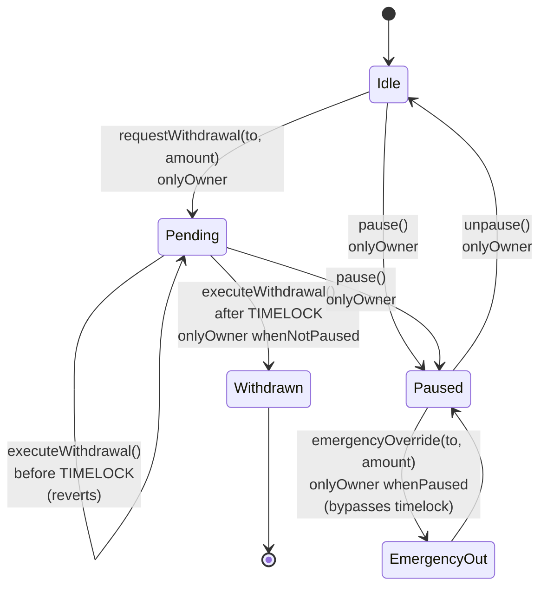

# solidity-contracts

> **Post-hackathon plan.** Cut from the May 3 2026 ETHGlobal submission. No `contracts/` directory exists in the repo yet. This skill describes what to build when the onchain layer comes online after the hackathon.

The onchain layer is intentionally minimal. Off-chain code is the source of truth for everything except: (1) verifiable policy version anchoring, and (2) optional timelocked emergency funds.

## What we put on chain

| Contract | Purpose | Required for MVP |
|---|---|---|
| `PolicyAnchor` | Records `keccak256(policyJson)` per `(owner, policyId)`, monotonically versioned. Lets KeeperHub workflows and auditors verify which policy was active at decision time. | Yes |
| `EmergencyVault` | Timelocked safe destination used by `safe-vault-evac`. Funds in instantly; withdrawals require a 24h delay or multisig override. | Stretch |
| `MockAutomation` | Tiny `Pausable` contract used by the `pause-automation` playbook in the demo. | Demo only |

## Foundry layout

```
contracts/
├── foundry.toml
├── remappings.txt
├── lib/                          # forge install output (openzeppelin)
├── src/
│   ├── PolicyAnchor.sol
│   ├── EmergencyVault.sol         # optional
│   └── mock/MockAutomation.sol
├── test/
│   ├── PolicyAnchor.t.sol
│   └── EmergencyVault.t.sol
└── script/
    └── Deploy.s.sol
```

`foundry.toml`:

```toml
[profile.default]
src = "src"
out = "out"
libs = ["lib"]
solc = "0.8.24"
optimizer = true
optimizer_runs = 200
via_ir = true
fs_permissions = [{ access = "read", path = "./" }]

[fmt]
line_length = 100
tab_width = 4
quote_style = "double"
```

Install OpenZeppelin once: `forge install OpenZeppelin/openzeppelin-contracts --no-commit`.

## PolicyAnchor

```solidity
// SPDX-License-Identifier: MIT
pragma solidity ^0.8.24;

contract PolicyAnchor {
    struct Anchor {
        bytes32 policyHash;
        uint64 version;
        uint64 updatedAt;
    }

    mapping(address owner => mapping(bytes32 policyId => Anchor)) public anchors;

    error VersionRegression(uint64 supplied, uint64 current);
    error EmptyHash();

    event PolicyUpdated(
        address indexed owner,
        bytes32 indexed policyId,
        bytes32 policyHash,
        uint64 version,
        uint64 updatedAt
    );

    function setAnchor(bytes32 policyId, bytes32 policyHash, uint64 version) external {
        if (policyHash == bytes32(0)) revert EmptyHash();
        Anchor storage a = anchors[msg.sender][policyId];
        if (version <= a.version) revert VersionRegression(version, a.version);
        a.policyHash = policyHash;
        a.version = version;
        a.updatedAt = uint64(block.timestamp);
        emit PolicyUpdated(msg.sender, policyId, policyHash, version, a.updatedAt);
    }

    function getAnchor(address owner, bytes32 policyId)
        external
        view
        returns (bytes32 policyHash, uint64 version, uint64 updatedAt)
    {
        Anchor storage a = anchors[owner][policyId];
        return (a.policyHash, a.version, a.updatedAt);
    }
}
```

Test:

```solidity
// SPDX-License-Identifier: MIT
pragma solidity ^0.8.24;

import { Test } from "forge-std/Test.sol";
import { PolicyAnchor } from "../src/PolicyAnchor.sol";

contract PolicyAnchorTest is Test {
    PolicyAnchor anchor;
    bytes32 constant POLICY_ID = keccak256("policy-1");
    address constant OWNER = address(0x1111);

    function setUp() public {
        anchor = new PolicyAnchor();
    }

    function test_setAnchor_emitsAndStores() public {
        bytes32 hash = keccak256("policy-json-v1");
        vm.prank(OWNER);
        vm.expectEmit(true, true, false, true);
        emit PolicyAnchor.PolicyUpdated(OWNER, POLICY_ID, hash, 1, uint64(block.timestamp));
        anchor.setAnchor(POLICY_ID, hash, 1);

        (bytes32 stored, uint64 v,) = anchor.getAnchor(OWNER, POLICY_ID);
        assertEq(stored, hash);
        assertEq(v, 1);
    }

    function test_setAnchor_revertsOnVersionRegression() public {
        vm.startPrank(OWNER);
        anchor.setAnchor(POLICY_ID, keccak256("v1"), 1);
        vm.expectRevert(abi.encodeWithSelector(
            PolicyAnchor.VersionRegression.selector, uint64(1), uint64(1)
        ));
        anchor.setAnchor(POLICY_ID, keccak256("v1-replay"), 1);
        vm.stopPrank();
    }

    function test_setAnchor_revertsOnEmptyHash() public {
        vm.prank(OWNER);
        vm.expectRevert(PolicyAnchor.EmptyHash.selector);
        anchor.setAnchor(POLICY_ID, bytes32(0), 1);
    }
}
```

## EmergencyVault (optional)

Pattern: `Ownable` + `Pausable` from OpenZeppelin, plus a 24-hour withdrawal timelock.



```solidity
// SPDX-License-Identifier: MIT
pragma solidity ^0.8.24;

import { Ownable } from "@openzeppelin/contracts/access/Ownable.sol";
import { Pausable } from "@openzeppelin/contracts/utils/Pausable.sol";
import { ReentrancyGuard } from "@openzeppelin/contracts/utils/ReentrancyGuard.sol";

contract EmergencyVault is Ownable, Pausable, ReentrancyGuard {
    uint256 public constant TIMELOCK = 24 hours;
    mapping(bytes32 => uint256) public requestedAt;

    error WithdrawalNotRequested();
    error TimelockNotElapsed(uint256 readyAt);

    event WithdrawalRequested(bytes32 indexed id, address indexed to, uint256 amount, uint256 readyAt);
    event WithdrawalExecuted(bytes32 indexed id, address indexed to, uint256 amount);

    constructor(address initialOwner) Ownable(initialOwner) {}

    receive() external payable {}

    function requestWithdrawal(address to, uint256 amount) external onlyOwner returns (bytes32 id) {
        id = keccak256(abi.encodePacked(to, amount, block.number, block.timestamp));
        requestedAt[id] = block.timestamp;
        emit WithdrawalRequested(id, to, amount, block.timestamp + TIMELOCK);
    }

    function executeWithdrawal(bytes32 id, address to, uint256 amount)
        external
        onlyOwner
        whenNotPaused
        nonReentrant
    {
        uint256 ts = requestedAt[id];
        if (ts == 0) revert WithdrawalNotRequested();
        if (block.timestamp < ts + TIMELOCK) revert TimelockNotElapsed(ts + TIMELOCK);
        delete requestedAt[id];
        (bool ok, ) = to.call{value: amount}("");
        require(ok, "transfer failed");
        emit WithdrawalExecuted(id, to, amount);
    }

    function emergencyOverride(address to, uint256 amount)
        external
        onlyOwner
        whenPaused
        nonReentrant
    {
        // Only callable when paused (i.e. an active incident bypasses the timelock).
        (bool ok, ) = to.call{value: amount}("");
        require(ok, "transfer failed");
    }
}
```

If you ship this contract, also wire the `safe-vault-evac` playbook to call `requestWithdrawal` immediately and emit a notification when the timelock elapses.

## Style rules

- Pragma: `^0.8.24` exact line. No older versions.
- Use **custom errors** (`error Foo();`) instead of `require(_, "string")`. Cheaper gas, typed reverts in clients.
- Use **named struct mapping syntax** (`mapping(address owner => ...)` ) — Solidity 0.8.18+ feature, improves readability.
- Indexed events: index the addresses and ids that downstream listeners (KeeperHub, auditors) will filter on. Do not index strings or large dynamic types.
- `external` over `public` when the function is not called inside the contract. Saves gas.
- Run `forge fmt` before committing. CI must check format with `forge fmt --check`.
- `forge test -vvv` should pass. Add `-vvvv` traces only when debugging locally.

## Deploy to Galileo

```sh
# Set env
export GALILEO_RPC=https://evmrpc-testnet.0g.ai
export DEPLOYER_PK=0x<funded testnet wallet>

# Compile
forge build

# Deploy
forge script script/Deploy.s.sol \
    --rpc-url $GALILEO_RPC \
    --private-key $DEPLOYER_PK \
    --broadcast \
    --verify=false
```

`script/Deploy.s.sol` writes the deployed addresses to `infra/contracts.toml` so the Rust crates can read them at startup.

## Gas / cost notes

- `PolicyAnchor.setAnchor` is called once per policy create + once per update. ~50k gas. Cheap on Galileo.
- `EmergencyVault.requestWithdrawal` + `executeWithdrawal` together cost ~100k. Negligible.
- The Galileo faucet drips 0.1 0G/wallet/day. Pre-fund the deployer to avoid surprises.

## Things to avoid

- Holding any non-emergency funds in custom contracts. The treasury wallet is the source of truth.
- Adding admin functions on `PolicyAnchor`. The contract is immutable by design.
- Importing `@openzeppelin/contracts-upgradeable`. We do not need proxies for the MVP.
- Using `tx.origin`. Use `msg.sender`.
- Verbose `require` strings. Use custom errors.
- Onchain logic that re-derives the off-chain policy decision. The chain only anchors hashes; the engine remains off-chain.
