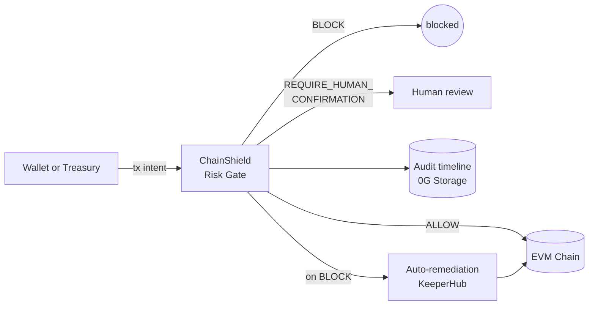

# ChainShield Agent

> Autonomous treasury and wallet protection — a policy-bound security agent that simulates, scores, and intercepts risky onchain actions before funds are lost.

Built for **ETHGlobal OpenAgents 2026** with sponsor integrations planned for **0G**, **KeeperHub**, and **Gensyn AXL**.

For the full product story, demo flow, and judge pitch, see [`docs/product-idea.md`](./docs/product-idea.md). For the system design and sponsor entry points, see [`docs/architecture.md`](./docs/architecture.md). Sponsor research notes live under [`docs/sponsors/`](./docs/sponsors). Project conventions for AI coding agents live in [`AGENTS.md`](./AGENTS.md).

## How it works at a glance



## Project status

Submission target: **Sun May 3 2026 night** (ETHGlobal OpenAgents).

| Item | Status | Where |
|---|---|---|
| Policy schema, decision engine (5 deterministic rules), risk-gate API, in-memory store | done | merged into `sponsor-features` (PR #1) |
| Validation hardening: `PolicyOwnerMismatch`, byte-aligned hex, scientific-notation cap, forbidden-selector short-circuit | done | merged |
| KeeperHub REST runner (`/api/workflow/:id/execute`), Mock fallback, error sanitization | done | PR #2, mergeable |
| Notification channels (Discord webhook, in-process Collector) | done | PR #2 |
| Engine wiring: `policy.remediation.onBlock` + `notifyChannels` (both rule-paths fire playbooks) | done | PR #2 |
| Astro frontend at `web/` (editorial-dispatch design, vanilla TS, components + lib modules) | done | PR #3, mergeable |
| `@fastify/cors`, parallel `bun run dev` via `scripts/dev.sh` | done | PR #3 |
| `kh.sh` REST CLI helper, JSON modal with copy-to-clipboard, onBlock form field | done | PR #2 + #3 |
| Heuristic transaction simulator (calldata decode + balance projection + revert escalation) | **not started** | next |
| 0G Storage adapter (replaces `InMemoryStore` for persistent timeline) | not started | day 5 |
| 0G Inference (LLM reflection + TEE attestation) | not started | stretch |
| CLI demo runner that fires the 4 scenes deterministically | not started | day 5 |
| 3–5 min demo recording + one-pager submission writeup | not started | day 5 |

**Tests:** 37/37 passing. Real KeeperHub fires real `executionId` end-to-end through the Astro → CORS → Fastify → KeeperHub stack.

**Cut from scope** (post-hackathon work): AXL three-binary mesh, Solidity `PolicyAnchor` / `EmergencyVault`, full Rust workspace port.

## Backend direction (post-hackathon)

After the hackathon ships, the bulk of the production backend is planned to move to **Rust** (`axum`, `revm`, `alloy`) with a small **Solidity** onchain layer (`PolicyAnchor`, optional `EmergencyVault`). The current TypeScript implementation under `src/` locks down the API contract, the policy schema, and the rule semantics — the Rust port reuses the JSON shapes (`Policy`, `TxIntent`, `Decision`) verbatim so `web/` and the existing `tests/` specs remain a black-box conformance suite.

The frontend lives in [`web/`](./web) as an **Astro** project (vanilla TypeScript islands, no React/Vue). It calls the Fastify API cross-origin in dev (Astro on `:4321`, Fastify on `:8787`) and ships as static HTML+JS in `web/dist/` for production.

See [`docs/architecture.md`](./docs/architecture.md) for the current implementation, the planned Rust workspace layout, and the migration order.

## Requirements

For the current TypeScript scaffold (Phase 1):

- [Bun](https://bun.sh) 1.1+ (only required if running outside Docker)
- Docker 24+ and Docker Compose v2 (only required for the containerized path)

For the upcoming Rust + Solidity work (Phase 2+):

- [Rust](https://rustup.rs) 1.83+ via `rustup`
- [Foundry](https://book.getfoundry.sh) for Solidity (`forge`, `cast`, `anvil`)

```sh
# install Bun (macOS/Linux/WSL)
curl -fsSL https://bun.sh/install | bash

# install Rust
curl --proto '=https' --tlsv1.2 -sSf https://sh.rustup.rs | sh

# install Foundry
curl -L https://foundry.paradigm.xyz | bash && foundryup

# verify
bun --version          # >= 1.1.0
docker --version       # >= 24.0
docker compose version # v2.x
rustc --version        # >= 1.83
forge --version
```

---

## Quick start with Bun

```sh
# install root deps (server) and web deps (Astro)
bun install
bun install --cwd web

# start both: Fastify API on :8787, Astro on :4321
bun run dev

# open the UI
open http://127.0.0.1:4321
```

The `dev` script (a small `scripts/dev.sh`) starts both processes with prefixed log output. Hit Ctrl+C in the terminal to stop both.

### All Bun commands

| Command | What it does |
|---|---|
| `bun install` | Install root (server) deps from `bun.lock`. |
| `bun install --cwd web` | Install Astro frontend deps in `web/`. |
| `bun run dev` | Start **both**: Fastify on `:8787` + Astro on `:4321`, prefixed logs. |
| `bun run dev:server` | Just the Fastify server (with `--watch`). |
| `bun run dev:web` | Just the Astro frontend. |
| `bun run start` | Start the server only, no watcher. |
| `bun run build` | Build both: server → `dist/`, Astro → `web/dist/`. |
| `bun run build:server` | Bundle and minify the server only. |
| `bun run build:web` | Build the Astro static output only. |
| `bun run preview:web` | Preview the built Astro output locally. |
| `bun run start:bundle` | Run the bundled server from `dist/`. |
| `bun run typecheck` | Run both: `tsc` for the server + `astro check` for the web. |
| `bun run typecheck:server` | Just the server typecheck. |
| `bun run typecheck:web` | Just the Astro check. |
| `bun test` | Run the server test suite (`bun:test`, 32 specs). |
| `bun test --watch` | Re-run server tests on file change. |
| `bun run test:coverage` | Server tests with v8 coverage. |
| `bun run clean` | Remove `dist/`, `coverage/`, `.tsbuildinfo`, `web/dist/`, `web/.astro/`. |

### Bun environment overrides

Set inline when launching:

```sh
PORT=8788 HOST=0.0.0.0 bun run dev          # bind to all interfaces on port 8788
PORT=9000 bun run start                      # production-style boot on port 9000
```

A full list of variables lives in `.env.example`. None are required for the Phase-1 build.

---

## Quick start with Docker

The Docker image is **server-only** for now — the Astro frontend ships separately as static files (deploy to Vercel, Netlify, Cloudflare Pages, or serve `web/dist` from any static host). A future revision will multi-stage the Astro build and serve `web/dist` from Fastify via `@fastify/static`.

```sh
# build and run the API
docker compose up --build

# open http://127.0.0.1:8787/health to confirm
```

To stop: `docker compose down`.

### All Docker commands (single container)

```sh
# build the image (tag = chainshield-agent)
docker build -t chainshield-agent .

# run it foreground, map port 8787
docker run --rm -p 8787:8787 --name chainshield chainshield-agent

# run detached
docker run -d -p 8787:8787 --name chainshield chainshield-agent

# follow logs
docker logs -f chainshield

# exec a shell inside the running container
docker exec -it chainshield sh

# stop and remove
docker stop chainshield && docker rm chainshield

# rebuild without cache (pin in case of stale layers)
docker build --no-cache -t chainshield-agent .

# inspect the image
docker image inspect chainshield-agent
docker history chainshield-agent
```

### All Docker Compose commands

```sh
# build and start (foreground)
docker compose up --build

# build and start (detached)
docker compose up -d --build

# follow logs from the chainshield service
docker compose logs -f chainshield

# show running services and health status
docker compose ps

# tail just the last 100 log lines
docker compose logs --tail=100 chainshield

# restart the service after a code change (rebuild)
docker compose up -d --build chainshield

# stop the stack but keep volumes/images
docker compose down

# nuke everything (containers, networks, images, volumes)
docker compose down --rmi local --volumes --remove-orphans
```

### Docker environment overrides

`docker-compose.yml` honors a host-side `PORT` if you want to map to a different port:

```sh
PORT=8788 docker compose up         # binds host 8788 → container 8787
```

Inside the container the server always listens on `0.0.0.0:8787` (set via `HOST` and `PORT` env in the Dockerfile).

---

## Verify the stack is up

After `bun run dev`, hit the health endpoint:

```sh
curl http://127.0.0.1:8787/health
# {"status":"ok"}
```

Open the **Astro UI** at <http://127.0.0.1:4321>. (The Fastify server on `:8787` is API-only after the Astro migration; it no longer serves HTML.)

---

## Environment variables

Copy `.env.example` to `.env.local` (gitignored, auto-loaded by Bun) and fill in what you need:

| Variable | Purpose | Required for |
|---|---|---|
| `PORT` | Risk-gate listen port (default `8787`) | always |
| `HOST` | Listen host (default `127.0.0.1`; container default `0.0.0.0`) | always |
| `WEB_ORIGIN` | Comma-separated CORS origins (default `http://127.0.0.1:4321,http://localhost:4321`) | Astro frontend |
| `KEEPERHUB_API_URL` | Default `https://app.keeperhub.com` | KeeperHub remediation |
| `KEEPERHUB_API_KEY` | Bearer token from app.keeperhub.com → API Keys → Organisation. Without it the engine uses the in-process `MockRunner`. | KeeperHub remediation |
| `NOTIFY_DISCORD_WEBHOOK` | Discord webhook URL. When set, a `discord` channel is auto-registered. | Discord notifications (optional) |
| `ZERO_G_RPC_URL` | 0G Galileo RPC endpoint | 0G storage / inference (not yet wired) |
| `ZERO_G_PRIVATE_KEY` | Funded testnet wallet | 0G storage / inference (not yet wired) |
| `ZERO_G_INFERENCE_PROVIDER` | Provider address for `qwen-2.5-7b-instruct` | 0G inference (not yet wired) |
| `AXL_BASE_URL` | Local Gensyn AXL bridge (default `http://127.0.0.1:9002`) | mesh (post-hackathon) |

---

## Browser walkthrough

Once `bun run dev` is running, open <http://127.0.0.1:4321> (the Astro frontend; not 8787 which is API-only). The page has three sections.

### 1. Policies

| Field | What to put | Effect |
|---|---|---|
| **Owner address** | A 20-byte EVM address (e.g. `0x1111111111111111111111111111111111111111`) | The wallet whose outflows this policy guards. |
| **Max transfer (ETH)** | A decimal number (e.g. `1`) | Per-tx native cap. Above → `BLOCK` (risk 90). |
| **Max daily outflow (ETH)** | A decimal number (e.g. `3`) | 24h rolling cap. Above → `BLOCK` (risk 88). |
| **Allowed destinations** | Comma-separated `0x` addresses (e.g. `0x2222...,0x3333...`) | Off-list → `REQUIRE_HUMAN_CONFIRMATION` (risk 60). Empty → no allowlist enforcement. |
| **Forbidden selectors** | Comma-separated 4-byte selectors (e.g. `0x095ea7b3,0x23b872dd`) | Match → `BLOCK` (risk 95). Common: `0x095ea7b3` ERC-20 `approve`, `0x23b872dd` `transferFrom`, `0xa9059cbb` `transfer`. |
| **Playbook IDs to fire on BLOCK** | Comma-separated KeeperHub workflow IDs (e.g. `8c12ujo1ax7b93w21updd`) | When verdict is `BLOCK`, the engine attempts each ID in order until one succeeds. Empty → no remediation. Run `./scripts/kh.sh list` to see your real workflow IDs. |

**Shortcut:** click **Quick demo** to auto-create a sample policy (`maxTransferEth=1`, `maxDailyOutflowEth=3`, allowlist `[0x2222…2222]`, forbidden `[0x095ea7b3]`).

### 2. Evaluate transaction intent

| Field | What to put | Notes |
|---|---|---|
| **Policy** | Pick from dropdown | Created in section 1. |
| **From** | `0x` address | Usually the policy owner. |
| **To** | `0x` address | Destination contract or wallet. |
| **Value (wei)** | Decimal wei (e.g. `1000000000000000000` = 1 ETH) | Use `0` for contract calls. |
| **Chain ID** | Integer (default `16602` = Galileo) | Mainnet `1`, Sepolia `11155111`. |
| **Calldata** | `0x` for plain transfer; otherwise hex-encoded call. First 4 bytes = function selector. | The selector is what *forbidden selectors* match against. |

**Four preset buttons** reproduce the canonical demo scenarios:

| Preset | Sends to | What you'll see |
|---|---|---|
| Safe transfer | Allowlisted vault, 0.5 ETH | `ALLOW`, risk 0 |
| Over-cap | Allowlisted vault, 5 ETH | `BLOCK`, risk 90, rules `maxTransferEth` + `maxDailyOutflowEth` |
| Forbidden approve | Token contract, `approve(attacker, MAX_UINT256)` | `BLOCK`, risk 95, rules `forbiddenSelectors` + `allowedDestinations` |
| Unknown destination | Random off-list address, 0.1 ETH | `REQUIRE_HUMAN_CONFIRMATION`, risk 60 |

### 3. Incident timeline

Every `/evaluate` call appends a row. Click **Refresh** after each evaluation. The newest entry appears on top.

---

## API reference

All endpoints accept and return JSON.

| Method | Path | Body | Returns |
|---|---|---|---|
| `GET` | `/health` | — | `{"status":"ok"}` |
| `GET` | `/` | — | the browser UI |
| `POST` | `/policies` | `PolicyInput` | `Policy` (201) |
| `PUT` | `/policies/:id` | `PolicyInput` | `Policy` |
| `GET` | `/policies/:id` | — | `Policy` (404 if missing) |
| `GET` | `/policies?owner=0x…` | — | `Policy[]` |
| `POST` | `/evaluate` | `{ policyId, intent }` | `Decision` (404 if policy missing) |
| `GET` | `/timeline?owner=&from=&to=` | — | `Decision[]` |

`PolicyInput`, `Policy`, `TxIntent`, and `Decision` are defined in [`src/core/types.ts`](./src/core/types.ts) and validated by [`src/core/schemas.ts`](./src/core/schemas.ts).

### Curl examples

```sh
# create a policy
POLICY_ID=$(curl -s -X POST http://127.0.0.1:8787/policies \
  -H "Content-Type: application/json" \
  -d '{
    "owner": "0x1111111111111111111111111111111111111111",
    "rules": { "maxTransferEth": 1, "allowedDestinations": ["0x2222222222222222222222222222222222222222"] }
  }' | bun -e "console.log(JSON.parse(await Bun.stdin.text()).id)")

# evaluate a safe transfer
curl -s -X POST http://127.0.0.1:8787/evaluate \
  -H "Content-Type: application/json" \
  -d "{
    \"policyId\": \"$POLICY_ID\",
    \"intent\": {
      \"from\": \"0x1111111111111111111111111111111111111111\",
      \"to\": \"0x2222222222222222222222222222222222222222\",
      \"value\": \"500000000000000000\",
      \"data\": \"0x\",
      \"chainId\": 16602
    }
  }"

# fetch the timeline
curl -s http://127.0.0.1:8787/timeline | jq
```

---

## Troubleshooting

**Port 8787 already in use** — `lsof -ti:8787 | xargs kill` or run on a different port: `PORT=8788 bun run dev`.

**Docker build cache stale** — `docker build --no-cache -t chainshield-agent .` or `docker compose build --no-cache`.

**`bun: command not found` inside container** — make sure you're using the `oven/bun:1.3-alpine` base; do not mix with `node:*` images.

**`bun install --frozen-lockfile` fails locally** — the lockfile diverges. Run `bun install` (no flag) to refresh it, then commit the new `bun.lock`.

**Tests fail after pulling** — `bun install` first, then `bun test`. The lockfile is committed.

**Compose container exits immediately** — `docker compose logs chainshield` to see why. Most common cause: another process is bound to port 8787 on the host.

---

## License

Hackathon-grade prototype. Treat as MIT-style for review purposes.
