<h1 align="center">ChainShield Agent</h1>

<p align="center">
  <strong>A policy-bound risk gate for treasury wallets and agent-controlled keys.</strong>
</p>

<p align="center">
  Every transaction passes a deterministic engine, gets simulated, gets anchored on 0G Storage, fires KeeperHub remediation playbooks on BLOCK, and gossips the verdict over the Gensyn AXL mesh - before it ever touches the chain.
</p>

<p align="center">
  <a href="https://github.com/AnkanMisra/ChainShield/actions/workflows/ci.yml"></a>
  
  
  
  
</p>

> Built for **ETHGlobal OpenAgents 2026**. TypeScript on Bun, end to end.

---

## At a glance

| | |
|---|---|
| **Status** | Shipped to `main`. 0G anchor verified live on Galileo testnet. |
| **API hot path** | `< 50 ms` (anchor uploads stream in the background) |
| **Verdicts** | `ALLOW` / `REQUIRE_HUMAN_CONFIRMATION` / `BLOCK` |
| **Decision ladder** | 5 deterministic rules + 1 heuristic ERC-20 simulator |
| **Test suite** | 114 specs / 13 files |
| **Type safety** | `tsc --noEmit` + `astro check`, both zero-error, strict + `noUncheckedIndexedAccess` |
| **Sponsors integrated** | 0G Storage, KeeperHub, Gensyn AXL, Discord webhooks |
| **Lines of TypeScript (server)** | `~1,700` across `src/` |
| **Runtime** | Bun `1.3.13` (CI and local pinned via `.bun-version`) |
| **Frontend** | Astro 6 at [`web/`](./web), separate Bun workspace |
| **Containerised** | `docker compose up --build` brings the whole stack up |

---

## Live on-chain proof

A real policy was anchored on 0G Galileo testnet during testing. Every value below is independently verifiable on the public explorers.

| Field | Value |
|---|---|
| **Anchor wallet** | [`0xF838D07667716120Ba7CD52AC3b3b5BDC7110c48`](https://chainscan-galileo.0g.ai/address/0xF838D07667716120Ba7CD52AC3b3b5BDC7110c48) |
| **Policy id** | `5a461d0e-bbbb-41d7-a810-addcda8bfc3f` |
| **0G storage rootHash** | [`0x574aaf45e8...0bd3901`](https://storagescan-galileo.0g.ai/tx/0x574aaf45e85ddcccac847ab6ebfbbd24c52f99bfa8034d4199d2fab660bd3901) |
| **Storage tx** | [`0xac7e0e7331...eb58a17`](https://chainscan-galileo.0g.ai/tx/0xac7e0e7331ef99766e9ffc6ebfb5f6da2701fe64087824b2b4f91d04ceb58a17) |
| **Block** | `31,238,985` |
| **Gas used** | `292,394` |
| **Network** | 0G Galileo testnet (chain id `16602`) |

---

## Why ChainShield

Hot wallets, treasury multisigs, and agent-controlled keys lose funds to a small, recurring set of patterns. Existing wallets either ask the user to approve everything (Safe, MetaMask) or run opaque ML scoring (Blockaid, Forta). Neither lets the **owner** author explicit, auditable rules with an autonomous remediation step when those rules are violated.

| Attack pattern | What happens | Rule that catches it |
|---|---|---|
| Drainer-style approval | Phishing UI requests `approve(spender, MAX_UINT256)` | `forbiddenSelectors` + `approvalCapByToken` |
| Recipient swap | UI shows trusted address, calldata sends to attacker | `allowedDestinations` |
| Over-cap transfer | Single transaction exceeds the per-tx ETH ceiling | `maxTransferEth` |
| Gradual drain | Many small transfers slowly empty the wallet | `maxDailyOutflowEth` (24h rolling) |
| Reverting calldata | Token has fee-on-transfer, blacklist, or pause | Heuristic simulator (calldata decode + balance projection) |
| Operational error | Treasury operator pastes the wrong address | `allowedDestinations` (downgrades to confirm) |

ChainShield sits in front of the wallet and intercepts every intent before signature.

---

## Three verdicts, five rules

The verdict ladder is **monotonic**: rules can only escalate, never downgrade. Order matters.

| # | Rule | Condition | Verdict | Risk | Notes |
|---|---|---|---|---|---|
| 1 | `forbiddenSelectors` | 4-byte selector is on the deny list | `BLOCK` | `95` | Short-circuits all other rules |
| 2 | `maxTransferEth` | Intent value exceeds per-tx ETH cap | `BLOCK` | `90` | |
| 3 | `maxDailyOutflowEth` | 24h rolling outflow exceeds cap | `BLOCK` | `88` | Reads timeline; ignores prior `BLOCK` rows |
| 4 | `approvalCapByToken` | ERC-20 `approve` amount exceeds per-token cap | `BLOCK` | `92` | |
| 5 | `allowedDestinations` | `to` address not on the allowlist | `REQUIRE_HUMAN_CONFIRMATION` | `60` | Cannot promote to `BLOCK` on its own |
| 6 | Simulator revert | Heuristic ERC-20 simulation fails | `REQUIRE_HUMAN_CONFIRMATION` | `70` | Calldata decode + balance projection |
| - | Defensive guards | Malformed wei strings, bad approval caps | `REQUIRE_HUMAN_CONFIRMATION` | `70` | `invalidIntentValue`, `invalidApprovalCap` |

| Verdict | Meaning | Side effects |
|---|---|---|
| `ALLOW` | Every rule passed | Persist + anchor on 0G |
| `REQUIRE_HUMAN_CONFIRMATION` | Soft fail | Persist + anchor + reasons surfaced to caller |
| `BLOCK` | Hard fail | Persist + anchor + KeeperHub playbook + Discord page + AXL gossip broadcast |

---

## Architecture

```mermaid
flowchart LR
    Caller[Wallet / treasury client]
    API[Risk-gate API<br/>Fastify 5]
    Engine[DecisionEngine<br/>5-rule ladder]
    Sim[HeuristicSimulator<br/>ERC-20 decode + balance projection]
    Store[ZeroGStore<br/>anchor + cache]
    Playbook[KeeperHubRunner]
    Gossip[AxlGossipTransport]
    ZG[(0G Galileo<br/>storage indexer)]
    KH[(KeeperHub<br/>workflow executor)]
    AXL[(Gensyn AXL<br/>local mesh node :9002)]

    Caller -->|POST /evaluate| API
    API --> Engine
    Engine -->|simulate| Sim
    Engine -->|persist + anchor| Store
    Store -->|"Indexer.upload(MemData(json))"| ZG
    ZG -->|"&#123;rootHash, txHash&#125;"| Store
    Engine -->|on BLOCK| Playbook
    Playbook -->|"POST /api/workflow/:id/execute"| KH
    Engine -->|on BLOCK| Gossip
    Gossip -->|"POST /api/v1/mcp/publish"| AXL
    Engine -->|verdict + anchor| API
    API --> Caller
```



The engine sits behind five trait-shaped seams. Every external dependency is replaceable; tests use lightweight fakes, production wires real adapters.

| Trait | Role | Real impl | Fallback impl |
|---|---|---|---|
| `Store` | Persist policies and decisions | `ZeroGStore` (0G anchor) | `InMemoryStore` |
| `Simulator` | Project balance deltas before signing | `HeuristicSimulator` (calldata decode) | unset (skipped) |
| `PlaybookRunner` | Fire remediation on `BLOCK` | `KeeperHubRunner` | `MockRunner` |
| `NotificationChannel` | Page operators | `WebhookChannel` (Discord) + `CollectorChannel` | unset |
| `GossipTransport` | Publish verdicts over the AXL mesh | `AxlGossipTransport` | `NoopGossip` |

---

## Sponsor integrations

### 0G Storage - tamper-evident audit trail

Every policy and every decision is JSON-serialised and uploaded to 0G Galileo via [`@0gfoundation/0g-storage-ts-sdk`](https://www.npmjs.com/package/@0gfoundation/0g-storage-ts-sdk). The returned `rootHash` and storage `txHash` are surfaced as a top-level `anchor` field on every API response and rendered as a click-to-verify lime pill in the timeline UI.

| Where | What |
|---|---|
| Adapter | [`src/memory/zeroGStore.ts`](./src/memory/zeroGStore.ts) |
| Upload call | [`src/memory/zeroGStore.ts#L108`](./src/memory/zeroGStore.ts#L108) - `await this.indexer.upload(file, this.rpcUrl, this.signer)` |
| Server wiring | [`src/risk-gate/server.ts`](./src/risk-gate/server.ts) - picks `ZeroGStore` when `ZERO_G_PRIVATE_KEY` is set |
| API surface | [`src/risk-gate/app.ts`](./src/risk-gate/app.ts) - `withAnchorPolicy` / `withAnchorDecision` augment every response |
| Live proof | rootHash table at the top of this README; explorer at <https://storagescan-galileo.0g.ai> |

**Soft-failure design.** Anchor uploads run asynchronously after the in-memory write returns. The hot path is `~50 ms` even though Galileo writes take `5-30 s`. If the indexer is down, the API still responds with `anchor: null` and the local store is unaffected.

### KeeperHub - auto-remediation playbooks

When the verdict is `BLOCK` and the policy declares `remediation.onBlock` workflow ids, the runner fires each id in order against the KeeperHub REST API. The returned `runId` is recorded on the decision and pushed through every configured `NotificationChannel`.

| Where | What |
|---|---|
| Adapter | [`src/playbooks/keeperhub.ts`](./src/playbooks/keeperhub.ts) |
| Execute call | [`src/playbooks/keeperhub.ts#L34`](./src/playbooks/keeperhub.ts#L34) - `POST /api/workflow/:id/execute` with bearer auth |
| Error scrubber | `summarizeErrorBody` collapses HTML 404 pages so KeeperHub error markup never leaks into UI reasons |
| Helper script | [`scripts/kh.sh`](./scripts/kh.sh) - `list / get / run / status / ping` subcommands |
| Verified workflow | `8c12ujo1ax7b93w21updd` fired live during demo |

### Gensyn AXL - decision gossip over the agent mesh

Every `BLOCK` decision is published to a local Gensyn AXL bridge node so co-operating ChainShield gates running on other machines react over the AXL mesh without a centralised relay. Soft-failure all the way down.

| Where | What |
|---|---|
| Adapter | [`src/transport/axlGossip.ts`](./src/transport/axlGossip.ts) |
| Publish call | [`src/transport/axlGossip.ts#L33-L66`](./src/transport/axlGossip.ts#L33-L66) - `POST ${AXL_BASE_URL}/api/v1/mcp/publish` with `{ topic, payload: { decision, policy } }` |
| Engine hook | [`src/core/engine.ts`](./src/core/engine.ts) - broadcast invoked from `handleRemediation` after the playbook runner |
| Server wiring | [`src/risk-gate/server.ts`](./src/risk-gate/server.ts) - picks `AxlGossipTransport` when `AXL_BASE_URL` is set, else `NoopGossip` |
| Default endpoint | `http://127.0.0.1:9002` (the documented AXL local HTTP bridge) |

### Discord - operator notification channel

`NOTIFY_DISCORD_WEBHOOK` adds a `discord` channel that posts a structured embed with verdict, risk score, decision id, and 0G anchor hash on every `BLOCK`.

| Where | What |
|---|---|
| Adapter | [`src/playbooks/notifier.ts`](./src/playbooks/notifier.ts) - `WebhookChannel` |
| Default template | Discord-shaped embed with `Verdict`, `Risk`, `Decision` fields |
| Custom shape | `contentTemplate` constructor option lets the same channel target Slack, Telegram, or any webhook |

---

## Quick start

```sh
git clone https://github.com/AnkanMisra/ChainShield
cd ChainShield

# 1. install both workspaces
bun install
(cd web && bun install)

# 2. wire credentials (KeeperHub key + funded 0G key)
cp .env.example .env.local

# 3. run the full stack in parallel
bun run dev                        # API on :8787, Astro on :4321

# 4. in another terminal, exercise the four canonical scenes
bun run demo
```

Or, with Docker:

```sh
docker compose up --build          # API + Astro both containerised
```

The Astro UI lands at <http://localhost:4321>; the API health check at <http://localhost:8787/health>.

### Script reference

| Command | What it does |
|---|---|
| `bun run dev` | Parallel: server on `:8787`, Astro on `:4321` |
| `bun run dev:server` | Just Fastify with hot reload |
| `bun run dev:web` | Just Astro |
| `bun run demo` | CLI runs four canonical scenes against the live API |
| `bun run typecheck` | `tsc --noEmit` (server) + `astro check` (web) |
| `bun test` | All 114 specs |
| `bun run build` | Server bundle + Astro static output |
| `bun run clean` | Remove `dist`, `coverage`, `.tsbuildinfo`, `web/dist`, `web/.astro` |

---

## Test coverage

`114 specs / 13 files`

| File | What it covers |
|---|---|
| `tests/api.test.ts` | Risk-gate Fastify API end-to-end |
| `tests/apiAnchor.test.ts` | Anchor surfacing on policy + decision responses, real `ZeroGStore` + `buildApp` e2e |
| `tests/axlGossip.test.ts` | `AxlGossipTransport` happy path, soft-failure, HTML error scrubbing, `NoopGossip` |
| `tests/clientIsolation.test.ts` | Multi-tenant decision isolation by client id |
| `tests/cors.test.ts` | CORS allowlist + Cloudflare Pages preview-domain regex |
| `tests/engine.test.ts` | 5-rule decision ladder + defensive guards |
| `tests/engineRemediation.test.ts` | Playbook trigger, notification fan-out, gossip broadcast |
| `tests/engineSimulation.test.ts` | Simulator integration + revert escalation |
| `tests/playbooks.test.ts` | KeeperHub runner, mock runner, notifier channels |
| `tests/policyService.test.ts` | Policy CRUD, version bumping, schema rejection |
| `tests/simulator.test.ts` | Heuristic ERC-20 calldata decode + balance deltas + typed approvals |
| `tests/webFormat.test.ts` | Astro renderer: `shortHash`, `anchorPillHtml`, `escapeHtml` adversarial XSS |
| `tests/zeroGStore.test.ts` | Anchor on write, soft-failure, empty-result handling, both response shapes |

Live anchor proofs are pinned as test constants in `tests/webFormat.test.ts` so the renderer is exercised against real chain data, not stubs.

---

## Repo layout

| Path | Purpose |
|---|---|
| `src/core/` | Types, Zod schemas, `PolicyService`, `DecisionEngine`, EVM selector helpers |
| `src/memory/` | `Store` interface, `InMemoryStore`, `ZeroGStore` (0G anchor adapter) |
| `src/simulator/` | `Simulator` interface, `HeuristicSimulator` |
| `src/playbooks/` | `PlaybookRunner` interface, `KeeperHubRunner`, `WebhookChannel`, `CollectorChannel` |
| `src/transport/` | `GossipTransport` interface, `AxlGossipTransport`, `NoopGossip` |
| `src/risk-gate/` | Fastify `app.ts` + `server.ts` composition root |
| `src/cli/` | `demo.ts` - four canonical scene runner |
| `tests/` | 114 specs across 13 files |
| `web/` | Astro 6 frontend (separate Bun workspace) |
| `docs/` | `submission.md`, `demo-script.md`, `architecture.md`, `deploy.md`, `sponsors/` |
| `scripts/` | `kh.sh` (KeeperHub helper), `dev.sh` (parallel dev) |
| `.github/workflows/` | CI: install + dual typecheck + 114 specs + Astro build + emoji scan |

---

## Quality bar

CI runs on every PR to `main` and every push. Green means every check below passed.

| Gate | Tool | Expected |
|---|---|---|
| Lockfiles frozen | `bun install --frozen-lockfile` | Both workspaces resolve cleanly |
| Server typecheck | `tsc --noEmit` | `0` errors |
| Web typecheck | `astro check` | `0` errors |
| Test suite | `bun test` | `109 / 109` pass |
| Production build | `astro build` + bundle | Succeeds |
| Emoji scan | `git grep` over banned UTF-8 sequences | `0` matches anywhere in tracked files |

The Bun version is pinned in [`.bun-version`](./.bun-version) and read by `setup-bun@v2`, so CI and local toolchains match byte-for-byte. Dependabot groups updates by area (server / web / actions / docker) and `ethers` majors are pinned until the 0G SDK supports them.

---

## Roadmap

| When | What | Status |
|---|---|---|
| **Now** | 5-rule ladder + heuristic simulator + 0G anchor + KeeperHub remediation + Discord channel + Gensyn AXL gossip | Shipped |
| **Now** | Astro frontend with policy editor, evaluate panel, anchor pills, optimistic anchor UX | Shipped |
| **Now** | Containerised stack via `docker compose` + free-tier deploy walkthrough (Render + Cloudflare Pages) | Shipped |
| **Next** | 0G Compute - LLM-assisted reason generation for borderline verdicts (env stub already in place) | Designed |
| **Next** | Multi-gate consensus over the AXL mesh - require N-of-M co-operating ChainShield instances to agree before broadcasting `BLOCK` | Designed |
| **Next** | Solidity `PolicyAnchor` + `EmergencyVault` contracts for onchain enforcement of `BLOCK` verdicts | Spec in `.claude/skills/solidity-contracts/` |
| **Later** | Rust port of the engine for hot-path latency under `5 ms` | Spec in `.claude/skills/rust-backend-style/` |

---

## Pointers

| | |
|---|---|
| Submission one-pager | [`docs/submission.md`](./docs/submission.md) |
| Demo recording walkthrough | [`docs/demo-script.md`](./docs/demo-script.md) |
| System design | [`docs/architecture.md`](./docs/architecture.md) |
| $0 deploy guide (Render + Cloudflare Pages) | [`docs/deploy.md`](./docs/deploy.md) |
| Sponsor research notes | [`docs/sponsors/`](./docs/sponsors) |
| Coding conventions for AI agents | [`AGENTS.md`](./AGENTS.md) |
| Project context for Claude Code | [`CLAUDE.md`](./CLAUDE.md) |

---

<p align="center">
  Built for <strong>ETHGlobal OpenAgents 2026</strong>. TypeScript on Bun, end to end.
</p>
