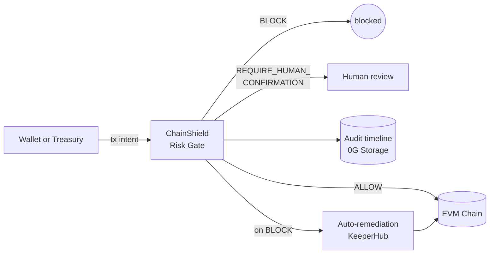

# ChainShield Agent

> Autonomous treasury and wallet protection — a policy-bound security agent that simulates, scores, and intercepts risky onchain actions before funds are lost.

Built for **ETHGlobal OpenAgents 2026** with sponsor integrations for **0G Storage** (anchored audit timeline) and **KeeperHub** (auto-remediation playbooks). 0G Compute is a stretch; Gensyn AXL was de-scoped after the timeline pivot.

**For judges:** start with [`docs/submission.md`](./docs/submission.md) for the one-pager, then [`docs/demo-script.md`](./docs/demo-script.md) for the demo walkthrough. For the full product story see [`docs/product-idea.md`](./docs/product-idea.md). System design and the post-hackathon Rust + Solidity roadmap live in [`docs/architecture.md`](./docs/architecture.md). Sponsor research notes are under [`docs/sponsors/`](./docs/sponsors). AI-agent conventions live in [`AGENTS.md`](./AGENTS.md).

## How it works at a glance



## Project status

**Done** — 68 tests passing across 9 files · TypeScript strict typecheck clean · Bun 1.3 toolchain · 0G Storage anchor verified live on Galileo testnet.

| Phase | Scope | PR | Status |
|---|---|---|---|
| 1 — Foundation | policy schema, decision engine, risk-gate API, in-memory store, browser UI, Docker | [#1](https://github.com/anurag-p6/ETHGlobal-2026-Agentic-Hack/pull/1) | merged |
| 2 — Actionability | KeeperHub playbook runner + notification channels, JSON modal, error hardening | [#2](https://github.com/anurag-p6/ETHGlobal-2026-Agentic-Hack/pull/2) | merged |
| 3 — Astro frontend | port UI to Astro at `web/`, CORS, parallel dev script | [#3](https://github.com/anurag-p6/ETHGlobal-2026-Agentic-Hack/pull/3) | merged |
| 4 — Simulator | heuristic ERC-20 simulator, revert-based verdict escalation | [#4](https://github.com/anurag-p6/ETHGlobal-2026-Agentic-Hack/pull/4) | merged |
| 5 — Demo CLI | `bun run demo` four canonical scenes against the live API | [#5](https://github.com/anurag-p6/ETHGlobal-2026-Agentic-Hack/pull/5) | merged |
| 6 — 0G Storage | anchor policies + decisions on Galileo testnet, surface `rootHash` in API + UI | [#6](https://github.com/anurag-p6/ETHGlobal-2026-Agentic-Hack/pull/6) | ready, live-verified |

**Left** — cascade phases 3-6 onto `sponsor-features` (one bundled retarget of #6 → `sponsor-features`), record the demo per [`docs/demo-script.md`](./docs/demo-script.md), submit to the ETHGlobal portal.

**De-scoped** — 0G Compute / LLM reflection (stretch), Gensyn AXL (no clear demo angle), Rust + Solidity port (post-hackathon).

## Stack

This hackathon submission is **TypeScript on Bun, end to end** — risk-gate server, decision engine, ERC-20 simulator, sponsor adapters, demo CLI, and Astro frontend. No Rust, no Solidity contracts in this repo. The architecture doc sketches a Rust + Solidity port as a post-hackathon roadmap; nothing onchain ships in this submission beyond the 0G Storage anchors.

| Layer | Tech |
|---|---|
| Runtime | Bun 1.3 |
| HTTP server | Fastify 5 |
| Schema validation | Zod |
| Frontend | Astro 6 (`web/`) + a static legacy UI at `public/index.html` |
| Tests | `bun:test` |
| Sponsor SDKs | `@0gfoundation/0g-storage-ts-sdk`, `ethers` v6, KeeperHub REST |

## Requirements

- [Bun](https://bun.sh) 1.1+ (only required if running outside Docker)
- Docker 24+ and Docker Compose v2 (only required for the containerized path)

```sh
# install Bun (macOS/Linux/WSL)
curl -fsSL https://bun.sh/install | bash

# verify
bun --version          # >= 1.1.0
docker --version       # >= 24.0
docker compose version # v2.x
```

---

## Quick start with Bun

```sh
bun install
bun run dev
# open http://127.0.0.1:8787
```

That's it. The `dev` script auto-reloads on every file change.

### All Bun commands

| Command | What it does |
|---|---|
| `bun install` | Install dependencies from `bun.lock`. |
| `bun install --frozen-lockfile` | CI-style install — fails if the lockfile would change. |
| `bun install --production` | Install runtime dependencies only (skips `@types/bun`, `typescript`). |
| `bun run dev` | Start the risk-gate server with file watching on `127.0.0.1:8787`. |
| `bun run start` | Start the server **without** watching (use this for production runs). |
| `bun run build` | Bundle and minify the server to `./dist/server.js`. |
| `bun run start:bundle` | Run the bundled output from `./dist`. |
| `bun run typecheck` | Strict `tsc --noEmit` — must exit 0 before commits. |
| `bun test` | Run the full test suite (68 specs across 9 files, ~250ms). |
| `bun test --watch` | Re-run tests on file change. |
| `bun run test:coverage` | Run tests with v8 coverage report. |
| `bun run clean` | Remove `dist/`, `coverage/`, `.tsbuildinfo`. |

### Bun environment overrides

Set inline when launching:

```sh
PORT=8788 HOST=0.0.0.0 bun run dev          # bind to all interfaces on port 8788
PORT=9000 bun run start                      # production-style boot on port 9000
```

A full list of variables lives in `.env.example`. None are required for a local in-memory boot.

---

## Quick start with Docker

```sh
# build and run in one step
docker compose up --build

# open http://127.0.0.1:8787
```

To stop: `docker compose down`.

### All Docker commands (single container)

```sh
# build the image (tag = chainshield-agent)
docker build -t chainshield-agent .

# run it foreground, map port 8787
docker run --rm -p 8787:8787 --name chainshield chainshield-agent

# run detached
docker run -d -p 8787:8787 --name chainshield chainshield-agent

# follow logs
docker logs -f chainshield

# exec a shell inside the running container
docker exec -it chainshield sh

# stop and remove
docker stop chainshield && docker rm chainshield

# rebuild without cache (pin in case of stale layers)
docker build --no-cache -t chainshield-agent .

# inspect the image
docker image inspect chainshield-agent
docker history chainshield-agent
```

### All Docker Compose commands

```sh
# build and start (foreground)
docker compose up --build

# build and start (detached)
docker compose up -d --build

# follow logs from the chainshield service
docker compose logs -f chainshield

# show running services and health status
docker compose ps

# tail just the last 100 log lines
docker compose logs --tail=100 chainshield

# restart the service after a code change (rebuild)
docker compose up -d --build chainshield

# stop the stack but keep volumes/images
docker compose down

# nuke everything (containers, networks, images, volumes)
docker compose down --rmi local --volumes --remove-orphans
```

### Docker environment overrides

`docker-compose.yml` honors a host-side `PORT` if you want to map to a different port:

```sh
PORT=8788 docker compose up         # binds host 8788 → container 8787
```

Inside the container the server always listens on `0.0.0.0:8787` (set via `HOST` and `PORT` env in the Dockerfile).

---

## Verify the server is up

After either path, hit the health endpoint:

```sh
curl http://127.0.0.1:8787/health
# {"status":"ok"}
```

Then open the UI at <http://127.0.0.1:8787>.

---

## Environment variables

Copy `.env.example` to `.env.local` and fill in only what you need. The server boots without any of these — opting into a sponsor adapter just enables the corresponding code path.

| Variable | Purpose | Default | Status |
|---|---|---|---|
| `PORT` | Risk-gate listen port | `8787` | wired |
| `HOST` | Listen host (container default `0.0.0.0`) | `127.0.0.1` | wired |
| `KEEPERHUB_API_URL` | KeeperHub base URL | `https://app.keeperhub.com` | wired (Phase 2) |
| `KEEPERHUB_API_KEY` | KeeperHub workflow execution key | — | wired (Phase 2) |
| `NOTIFY_DISCORD_WEBHOOK` | Discord webhook for `discord` notify channel | — | wired (Phase 2) |
| `ZERO_G_RPC_URL` | 0G Galileo EVM RPC | `https://evmrpc-testnet.0g.ai` | wired (Phase 6) |
| `ZERO_G_INDEXER_RPC` | 0G storage indexer | `https://indexer-storage-testnet-turbo.0g.ai` | wired (Phase 6) |
| `ZERO_G_PRIVATE_KEY` | Wallet for 0G storage anchor signing (needs faucet funding) | — | wired (Phase 6) |
| `ZERO_G_INFERENCE_PROVIDER` | 0G Compute provider address (discovered at runtime) | — | stub (stretch) |
| `AXL_BASE_URL` | Gensyn AXL bridge | `http://127.0.0.1:9002` | stub (de-scoped) |

---

## Browser walkthrough

Once the server is up, http://127.0.0.1:8787 renders a single-page UI with three sections.

### 1. Policies

| Field | What to put | Effect |
|---|---|---|
| **Owner address** | A 20-byte EVM address (e.g. `0x1111111111111111111111111111111111111111`) | The wallet whose outflows this policy guards. |
| **Max transfer (ETH)** | A decimal number (e.g. `1`) | Per-tx native cap. Above → `BLOCK` (risk 90). |
| **Max daily outflow (ETH)** | A decimal number (e.g. `3`) | 24h rolling cap. Above → `BLOCK` (risk 88). |
| **Allowed destinations** | Comma-separated `0x` addresses (e.g. `0x2222...,0x3333...`) | Off-list → `REQUIRE_HUMAN_CONFIRMATION` (risk 60). Empty → no allowlist enforcement. |
| **Forbidden selectors** | Comma-separated 4-byte selectors (e.g. `0x095ea7b3,0x23b872dd`) | Match → `BLOCK` (risk 95). Common: `0x095ea7b3` ERC-20 `approve`, `0x23b872dd` `transferFrom`, `0xa9059cbb` `transfer`. |

**Shortcut:** click **Quick demo** to auto-create a sample policy (`maxTransferEth=1`, `maxDailyOutflowEth=3`, allowlist `[0x2222…2222]`, forbidden `[0x095ea7b3]`).

### 2. Evaluate transaction intent

| Field | What to put | Notes |
|---|---|---|
| **Policy** | Pick from dropdown | Created in section 1. |
| **From** | `0x` address | Usually the policy owner. |
| **To** | `0x` address | Destination contract or wallet. |
| **Value (wei)** | Decimal wei (e.g. `1000000000000000000` = 1 ETH) | Use `0` for contract calls. |
| **Chain ID** | Integer (default `16602` = Galileo) | Mainnet `1`, Sepolia `11155111`. |
| **Calldata** | `0x` for plain transfer; otherwise hex-encoded call. First 4 bytes = function selector. | The selector is what *forbidden selectors* match against. |

**Four preset buttons** reproduce the canonical demo scenarios:

| Preset | Sends to | What you'll see |
|---|---|---|
| Safe transfer | Allowlisted vault, 0.5 ETH | `ALLOW`, risk 0 |
| Over-cap | Allowlisted vault, 5 ETH | `BLOCK`, risk 90, rules `maxTransferEth` + `maxDailyOutflowEth` |
| Forbidden approve | Token contract, `approve(attacker, MAX_UINT256)` | `BLOCK`, risk 95, rules `forbiddenSelectors` + `allowedDestinations` |
| Unknown destination | Random off-list address, 0.1 ETH | `REQUIRE_HUMAN_CONFIRMATION`, risk 60 |

### 3. Incident timeline

Every `/evaluate` call appends a row. Click **Refresh** after each evaluation. The newest entry appears on top.

---

## API reference

All endpoints accept and return JSON.

| Method | Path | Body | Returns |
|---|---|---|---|
| `GET` | `/health` | — | `{"status":"ok"}` |
| `GET` | `/` | — | the browser UI |
| `POST` | `/policies` | `PolicyInput` | `Policy` (201) |
| `PUT` | `/policies/:id` | `PolicyInput` | `Policy` |
| `GET` | `/policies/:id` | — | `Policy` (404 if missing) |
| `GET` | `/policies?owner=0x…` | — | `Policy[]` |
| `POST` | `/evaluate` | `{ policyId, intent }` | `Decision` (404 if policy missing) |
| `GET` | `/timeline?owner=&from=&to=` | — | `Decision[]` |

`PolicyInput`, `Policy`, `TxIntent`, and `Decision` are defined in [`src/core/types.ts`](./src/core/types.ts) and validated by [`src/core/schemas.ts`](./src/core/schemas.ts).

### Curl examples

```sh
# create a policy
POLICY_ID=$(curl -s -X POST http://127.0.0.1:8787/policies \
  -H "Content-Type: application/json" \
  -d '{
    "owner": "0x1111111111111111111111111111111111111111",
    "rules": { "maxTransferEth": 1, "allowedDestinations": ["0x2222222222222222222222222222222222222222"] }
  }' | bun -e "console.log(JSON.parse(await Bun.stdin.text()).id)")

# evaluate a safe transfer
curl -s -X POST http://127.0.0.1:8787/evaluate \
  -H "Content-Type: application/json" \
  -d "{
    \"policyId\": \"$POLICY_ID\",
    \"intent\": {
      \"from\": \"0x1111111111111111111111111111111111111111\",
      \"to\": \"0x2222222222222222222222222222222222222222\",
      \"value\": \"500000000000000000\",
      \"data\": \"0x\",
      \"chainId\": 16602
    }
  }"

# fetch the timeline
curl -s http://127.0.0.1:8787/timeline | jq
```

---

## Troubleshooting

**Port 8787 already in use** — `lsof -ti:8787 | xargs kill` or run on a different port: `PORT=8788 bun run dev`.

**Docker build cache stale** — `docker build --no-cache -t chainshield-agent .` or `docker compose build --no-cache`.

**`bun: command not found` inside container** — make sure you're using the `oven/bun:1.3-alpine` base; do not mix with `node:*` images.

**`bun install --frozen-lockfile` fails locally** — the lockfile diverges. Run `bun install` (no flag) to refresh it, then commit the new `bun.lock`.

**Tests fail after pulling** — `bun install` first, then `bun test`. The lockfile is committed.

**Compose container exits immediately** — `docker compose logs chainshield` to see why. Most common cause: another process is bound to port 8787 on the host.

---

## License

Hackathon-grade prototype. Treat as MIT-style for review purposes.
