# ChainShield Agent

> A policy-bound risk gate for treasury wallets — every transaction passes a deterministic engine, gets simulated, gets anchored on 0G, and triggers KeeperHub remediation playbooks before it ever touches the chain.

Built for **ETHGlobal OpenAgents 2026**. TypeScript on Bun, end to end.

| | |
|---|---|
| Submission one-pager | [`docs/submission.md`](./docs/submission.md) |
| Demo recording walkthrough | [`docs/demo-script.md`](./docs/demo-script.md) |
| System design | [`docs/architecture.md`](./docs/architecture.md) |
| Sponsor research | [`docs/sponsors/`](./docs/sponsors) |
| Coding conventions | [`AGENTS.md`](./AGENTS.md) |

---

## Live on-chain proof

A real policy was anchored on 0G Galileo testnet during testing. Anyone can independently verify these on the public explorers.

| | |
|---|---|
| Anchor wallet | [`0xF838D07667716120Ba7CD52AC3b3b5BDC7110c48`](https://chainscan-galileo.0g.ai/address/0xF838D07667716120Ba7CD52AC3b3b5BDC7110c48) |
| 0G storage rootHash | `0x574aaf45e85ddcccac847ab6ebfbbd24c52f99bfa8034d4199d2fab660bd3901` |
| Storage tx | [`0xac7e0e73…ceb58a17`](https://chainscan-galileo.0g.ai/tx/0xac7e0e7331ef99766e9ffc6ebfb5f6da2701fe64087824b2b4f91d04ceb58a17) |
| Block | 31238985 |
| Gas | 292,394 |

---

## What it is

Treasury and hot-wallet agents have no in-the-loop guard between an LLM's decision and the signed transaction that hits the chain. Existing wallets either ask the user to approve everything (Safe, MetaMask) or run opaque ML scoring (Blockaid, Forta). Neither lets the **owner** author explicit, auditable rules and have an autonomous remediation step when those rules are violated.

ChainShield sits in front of the wallet and intercepts every transaction intent. A deterministic policy engine evaluates the intent against the owner's rules, runs a heuristic ERC-20 simulation, anchors the resulting decision JSON on 0G Storage, and — if the verdict is `BLOCK` — fires a KeeperHub remediation playbook (revoke approvals, evacuate to a cold vault, page the on-call). The decision returns to the caller as one of three verdicts: `ALLOW`, `REQUIRE_HUMAN_CONFIRMATION`, or `BLOCK`.

The shape is a small TypeScript service: Fastify HTTP API, Astro frontend, in-memory cache fronting a 0G anchor, KeeperHub REST adapter behind an interface. No Rust, no Solidity. The verdict ladder is monotonic — rules can only escalate the verdict, never downgrade it.

---

## Architecture

```mermaid
flowchart LR
    Caller[Wallet / treasury client]
    API[Risk-gate API<br/>Fastify]
    Engine[DecisionEngine<br/>5-rule ladder]
    Sim[HeuristicSimulator<br/>ERC-20 decode + balance projection]
    Store[ZeroGStore<br/>anchor + cache]
    Playbook[KeeperHubRunner]
    ZG[(0G Galileo<br/>storage indexer)]
    KH[(KeeperHub<br/>workflow executor)]

    Caller -->|POST /evaluate| API
    API --> Engine
    Engine -->|simulate| Sim
    Engine -->|persist + anchor| Store
    Store -->|"Indexer.upload(MemData(json))"| ZG
    ZG -->|"&#123;rootHash, txHash&#125;"| Store
    Engine -->|on BLOCK| Playbook
    Playbook -->|"POST /api/workflow/:id/execute"| KH
    Engine -->|verdict + anchor| API
    API --> Caller
```



Five trait-shaped seams keep every external dependency replaceable: `Store`, `Simulator`, `PlaybookRunner`, `NotificationChannel`, and the engine's `now()` / `idGen()` injectables. Tests use a fresh `InMemoryStore` and a `StaticSimulator` per spec; production wires `ZeroGStore` and `HeuristicSimulator`.

---

## Sponsor integrations

### 0G Storage — anchored audit timeline

Every policy and decision JSON is uploaded to 0G Galileo via `@0gfoundation/0g-storage-ts-sdk`. The returned `rootHash` and storage `txHash` are stored alongside the cached object and surfaced on every API response as a top-level `anchor` field, so anyone holding a decision id can reconstruct the on-chain proof.

- Adapter: [`src/memory/zeroGStore.ts`](./src/memory/zeroGStore.ts)
- Upload call site: [`src/memory/zeroGStore.ts:108`](./src/memory/zeroGStore.ts#L108) — `await this.indexer.upload(file, this.rpcUrl, this.signer)`
- Server wiring: [`src/risk-gate/server.ts`](./src/risk-gate/server.ts) — picks `ZeroGStore` when `ZERO_G_PRIVATE_KEY` is set, falls back to `InMemoryStore` otherwise
- API surface: [`src/risk-gate/app.ts`](./src/risk-gate/app.ts) — `withAnchorPolicy` / `withAnchorDecision` augment every response
- Live proof: see the rootHash table at the top of this README. Storage explorer: <https://storagescan-galileo.0g.ai>

### KeeperHub — auto-remediation playbooks

When the verdict is `BLOCK` and the policy has `remediation.onBlock` workflow ids, the runner fires each id in order against the KeeperHub REST API. The returned `runId` is recorded on the decision and pushed through every configured `NotificationChannel`.

- Adapter: [`src/playbooks/keeperhub.ts`](./src/playbooks/keeperhub.ts)
- Execute call site: [`src/playbooks/keeperhub.ts:34`](./src/playbooks/keeperhub.ts#L34) — `POST /api/workflow/:id/execute` with bearer auth
- HTML 404 / non-JSON error scrubbing: same file, `summarizeErrorBody` helper (so KeeperHub error pages never leak into UI reasons)
- Helper script: [`scripts/kh.sh`](./scripts/kh.sh) — `list / get / run / status / ping` subcommands
- Verified workflow: `8c12ujo1ax7b93w21updd` fired during demo against the live KeeperHub API

---

## How to run

```sh
# 1. clone and install
git clone https://github.com/anurag-p6/ETHGlobal-2026-Agentic-Hack
cd ETHGlobal-2026-Agentic-Hack
bun install

# 2. configure
cp .env.example .env.local
# edit .env.local to add KEEPERHUB_API_KEY and ZERO_G_PRIVATE_KEY (see "Funding" below)

# 3. boot the API + UI together
bun run dev                       # http://127.0.0.1:8787

# 4. drive the four canonical scenes from the CLI
bun run demo                      # exits 0 if all four verdicts match expected
```

### Funding the 0G wallet

The 0G adapter only kicks in when `ZERO_G_PRIVATE_KEY` is set and the wallet has Galileo testnet balance. Generate a fresh throwaway key, then drip 0.1 0G:

```sh
# generate a fresh test wallet
bun -e 'import { Wallet } from "ethers"; const w = Wallet.createRandom(); console.log("ADDRESS:", w.address); console.log("PRIVATE_KEY:", w.privateKey)'

# paste ADDRESS at https://faucet.0g.ai (X login) or https://cloud.google.com/application/web3/faucet/0g/galileo (Google login)
# paste PRIVATE_KEY into .env.local as ZERO_G_PRIVATE_KEY=0x...
```

Without funding the server still works — the in-memory store is the fallback and the API simply omits the `anchor` field. Anchoring is best-effort, never blocking.

### Docker

```sh
docker compose up --build         # builds and runs on host port 8787
```

---

## What's verified

- **68 specs across 9 files**, all green. Run with `bun test`.
- **TypeScript strict typecheck** clean. Run with `bun run typecheck`.
- **Live 0G anchor** end-to-end on Galileo. RootHash and storage tx in the table at the top — verifiable on the public explorer.
- **Four canonical scenes** through the CLI demo:
  - Safe transfer to allowlisted vault → `ALLOW`, risk 0
  - Over-cap transfer (5 ETH > 1 ETH cap) → `BLOCK`, risk 90
  - Forbidden infinite `approve(attacker, MAX_UINT256)` → `BLOCK`, risk 95
  - Off-allowlist destination → `REQUIRE_HUMAN_CONFIRMATION`, risk 60
- **KeeperHub workflow execution** — workflow id `8c12ujo1ax7b93w21updd` fires on `BLOCK` and the run id round-trips into the decision record. Verifiable in the KeeperHub Runs tab.
- **Soft-failure path** — when 0G upload errors or throws, the local write still succeeds, the warning is logged, the API returns the policy without the `anchor` field. Covered by `tests/zeroGStore.test.ts`.

---

## Repo layout

```
src/
├── core/            # types, Zod schemas, policy service, decision engine
├── memory/          # Store interface, InMemoryStore, ZeroGStore (0G anchor)
├── simulator/       # Simulator interface, HeuristicSimulator (ERC-20 decode)
├── playbooks/       # PlaybookRunner interface, KeeperHubRunner, notifiers
├── risk-gate/       # Fastify app + server entrypoint
└── cli/             # bun run demo — four-scene CLI

tests/               # 68 bun:test specs
web/                 # Astro 6 frontend (components, lib, pages, styles)
public/index.html    # legacy single-page UI
scripts/             # kh.sh, dev.sh
docs/                # submission, demo-script, architecture, sponsors
```

---

## Built with

- [Bun](https://bun.sh) 1.3 — runtime, package manager, test runner, bundler
- [Fastify](https://fastify.dev) 5 + [`@fastify/cors`](https://github.com/fastify/fastify-cors)
- [Zod](https://zod.dev) — request/response validation at the boundary
- [ethers](https://docs.ethers.org/v6/) v6 — signer for 0G storage transactions
- [`@0gfoundation/0g-storage-ts-sdk`](https://github.com/0gfoundation/0g-storage-ts-sdk) — Galileo testnet anchoring
- [Astro](https://astro.build) 6 — frontend at `web/`
- KeeperHub REST — workflow execution

---

## Status

| Phase | Scope | PR |
|---|---|---|
| 1 — Foundation | policy schema, decision engine, API, in-memory store, UI, Docker | [#1](https://github.com/anurag-p6/ETHGlobal-2026-Agentic-Hack/pull/1) merged |
| 2 — Actionability | KeeperHub runner, notification channels, JSON modal | [#2](https://github.com/anurag-p6/ETHGlobal-2026-Agentic-Hack/pull/2) merged |
| 3 — Astro frontend | port UI to Astro at `web/`, CORS, parallel dev script | [#3](https://github.com/anurag-p6/ETHGlobal-2026-Agentic-Hack/pull/3) merged |
| 4 — Simulator | heuristic ERC-20 simulator, revert-based escalation | [#4](https://github.com/anurag-p6/ETHGlobal-2026-Agentic-Hack/pull/4) merged |
| 5 — Demo CLI | `bun run demo` four-scene CLI | [#5](https://github.com/anurag-p6/ETHGlobal-2026-Agentic-Hack/pull/5) merged |
| 6 — 0G Storage | anchor on Galileo, surface rootHash in API + UI | [#6](https://github.com/anurag-p6/ETHGlobal-2026-Agentic-Hack/pull/6) ready, live-verified |

**De-scoped.** 0G Compute / LLM reflection (stretch), Gensyn AXL (no clear demo angle), Rust + Solidity port (post-hackathon — see [`docs/architecture.md`](./docs/architecture.md) for the design).

---

## Reference

<details>
<summary>Environment variables</summary>

| Variable | Purpose | Default | Status |
|---|---|---|---|
| `PORT` | Risk-gate listen port | `8787` | wired |
| `HOST` | Listen host | `127.0.0.1` | wired |
| `KEEPERHUB_API_URL` | KeeperHub base URL | `https://app.keeperhub.com` | wired |
| `KEEPERHUB_API_KEY` | KeeperHub workflow execution key | — | wired |
| `NOTIFY_DISCORD_WEBHOOK` | Discord webhook for `discord` notify channel | — | optional |
| `ZERO_G_RPC_URL` | 0G Galileo EVM RPC | `https://evmrpc-testnet.0g.ai` | wired |
| `ZERO_G_INDEXER_RPC` | 0G storage indexer | `https://indexer-storage-testnet-turbo.0g.ai` | wired |
| `ZERO_G_PRIVATE_KEY` | Wallet for 0G storage anchor signing | — | wired |
| `ZERO_G_INFERENCE_PROVIDER` | 0G Compute provider address (discovered at runtime) | — | stub |
| `AXL_BASE_URL` | Gensyn AXL bridge | `http://127.0.0.1:9002` | de-scoped |
</details>

<details>
<summary>API endpoints</summary>

| Method | Path | Body | Returns |
|---|---|---|---|
| `GET` | `/health` | — | `{"status":"ok"}` |
| `GET` | `/` | — | the legacy browser UI |
| `POST` | `/policies` | `PolicyInput` | `Policy` (with `anchor`) |
| `PUT` | `/policies/:id` | `PolicyInput` | `Policy` |
| `GET` | `/policies/:id` | — | `Policy` (404 if missing) |
| `GET` | `/policies?owner=0x…` | — | `Policy[]` |
| `POST` | `/evaluate` | `{ policyId, intent }` | `Decision` (with `anchor`) |
| `GET` | `/timeline?owner=&from=&to=` | — | `Decision[]` |

`PolicyInput`, `Policy`, `TxIntent`, `Decision` — see [`src/core/types.ts`](./src/core/types.ts).
</details>

<details>
<summary>Bun + Docker commands</summary>

```sh
# Bun
bun install                       # install deps from bun.lock
bun run dev                       # watch mode on :8787
bun run start                     # production-style boot (no watch)
bun run build                     # bundle + minify to ./dist/server.js
bun run start:bundle              # run the bundled output
bun run typecheck                 # tsc --noEmit
bun test                          # 68 specs, ~250ms
bun run test:coverage             # v8 coverage
bun run demo                      # CLI four-scene runner

# Docker
docker compose up --build         # build + run on :8787
docker compose down               # stop the stack
docker compose logs -f chainshield
```
</details>

---

## License

Hackathon-grade prototype. Treat as MIT-style for review.
