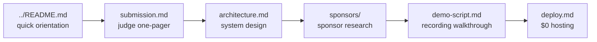

# `docs/` — project documentation

> Everything that is not source code, organised so judges, contributors, and future-you can find what they need in one click.

| File | Audience | What it covers |
|---|---|---|
| [`submission.md`](./submission.md) | ETHGlobal judges | One-pager: track, sponsors used, on-chain proof table, decision-engine summary, run instructions, test coverage |
| [`demo-script.md`](./demo-script.md) | Recording team | Verbatim 7-beat walkthrough for the demo video |
| [`architecture.md`](./architecture.md) | Maintainers + reviewers | System design, 8-step decision flow, post-hackathon Rust + Solidity roadmap |
| [`deploy.md`](./deploy.md) | Anyone hosting it | $0 deploy walkthrough on Render + Cloudflare Pages, including CORS + keepalive config |
| [`product-idea.md`](./product-idea.md) | Future-you | Original product framing notes from the planning session |
| [`sponsors/`](./sponsors) | Maintainers + sponsors | Per-sponsor research notes — see [`sponsors/README.md`](./sponsors/README.md) |

## Reading order

## Conventions

- All docs are plain Markdown with optional Mermaid blocks.
- Every doc that references a file uses a relative link so GitHub renders them and offline editors can follow them.
- No emojis anywhere — the same project-wide rule the source code follows. CI scans these files too.
- Live on-chain proof (rootHash, storage tx, block, gas) is duplicated in [`../README.md`](../README.md) and [`submission.md`](./submission.md) so judges can verify before clicking through.

## Pointers

| | |
|---|---|
| Project root | [`../README.md`](../README.md) |
| Source | [`../src/`](../src) |
| Tests | [`../tests/`](../tests) |
| Frontend | [`../web/`](../web) |
| Conventions for AI agents | [`../AGENTS.md`](../AGENTS.md) |
