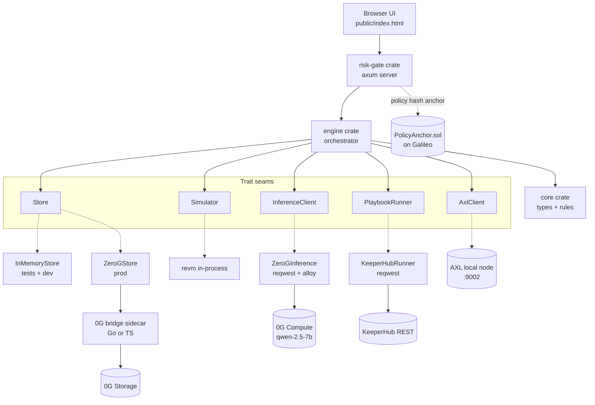
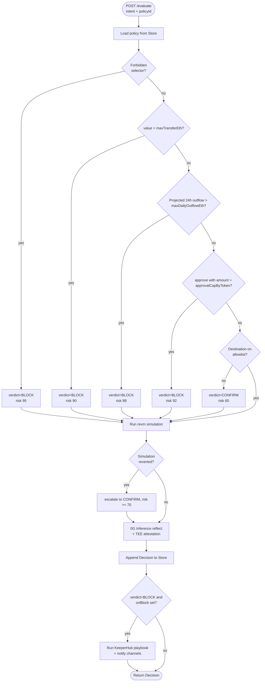
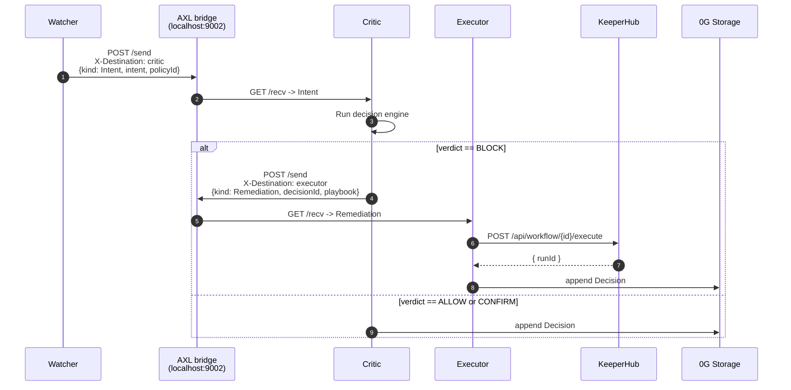

# ChainShield Agent — Architecture

Concrete design for the ChainShield product, mapped onto the three sponsor APIs (0G, KeeperHub, Gensyn AXL).

## Current implementation (what's shipping for the May 3 hackathon)

The hackathon submission is **TypeScript end-to-end**. The Rust + Solidity sections below describe the **post-hackathon** target architecture and remain the long-term home, but they are explicitly out of scope for the deadline.

| Layer | Today | Future |
|---|---|---|
| Risk-gate HTTP server | Fastify 5 + `@fastify/cors` (`src/risk-gate/`) | Axum (`crates/risk-gate/`) |
| Decision engine | `DecisionEngine` in `src/core/engine.ts` | `crates/engine/` |
| Policy schema + validation | Zod (`src/core/schemas.ts`) | serde + custom validation |
| Persistence | `InMemoryStore` (`src/memory/`) — 0G Storage adapter is the next gap | `crates/memory/` + 0G sidecar |
| Onchain client | ethers v6 (declared, not wired) | `alloy` |
| Simulation | **not implemented yet** — heuristic simulator is the next-up task | `revm` in-process |
| KeeperHub | `KeeperHubRunner` in `src/playbooks/keeperhub.ts` against real `POST /api/workflow/{id}/execute` (singular path) — verified end-to-end with real `executionId` | same REST, ported to Rust later |
| Notifications | `WebhookChannel` (Discord-shaped) + `CollectorChannel` in `src/playbooks/notifier.ts` | same traits, Rust impl |
| 0G Inference | not implemented yet (HTTP wrapper planned) | reqwest + alloy headers |
| Frontend | Astro 6 at `web/` (vanilla TS, no React/Vue), served on `:4321` in dev, builds to static `web/dist/` | unchanged |
| Solidity onchain anchor | not implemented (out of hackathon scope) | Foundry project at `contracts/` |
| AXL mesh | not implemented (out of hackathon scope) | three Rust binaries |

Tests today: 37 passing across engine rules, policy service, API endpoints, KeeperHub runner, notification channels, and remediation flow.

**The Rust + Solidity sections that follow describe the planned migration after submission.** They are referenced by the post-hackathon skills (`rust-backend-style`, `solidity-contracts`) and are not the current shipping code.

---

## Tech Stack (planned, post-hackathon)

| Layer | Choice | Reason |
|---|---|---|
| Language (backend) | Rust 1.83+ | Memory-safe, fast, ideal for a high-throughput risk gate that handles untrusted EVM data. Best-in-class EVM tooling (`revm`, `alloy`). |
| Workspace tool | Cargo workspace | One repo, multiple crates, shared lockfile. |
| Risk gate API | `axum` + `tower` | Async, ergonomic, integrates with `tokio`. Native JSON via `serde`. |
| Onchain client | `alloy` (preferred) or `ethers-rs` | `alloy` is the modern successor with stronger typing; `ethers-rs` is the fallback if a dep is not yet ported. |
| Simulation | `revm` | Run the EVM in-process against a forked Galileo state — deterministic, fast, no external service. |
| LLM client | `reqwest` (HTTP) | The 0G inference endpoint is OpenAI-compatible; no SDK needed. |
| Persistence | 0G Storage via a small Go/TS sidecar | The 0G SDK is Go and TypeScript only; the sidecar exposes upload/download as HTTP for the Rust crates. |
| Mesh transport | Gensyn AXL local node @ `localhost:9002` | The AXL bridge is HTTP — Rust talks to it directly via `reqwest`. |
| Remediation execution | KeeperHub REST (`https://app.keeperhub.com/api/...`) | No SDK needed; plain HTTP from `reqwest`. |
| Onchain (Solidity) | Solidity 0.8.24+ via Foundry | `PolicyAnchor` and an optional `EmergencyVault`. OpenZeppelin for `Ownable`/`Pausable`. |
| Browser UI | Static `public/index.html`, vanilla JS | No build step. Same UI regardless of which backend serves it. |
| Containerization | Docker (`oven/bun` for the TS scaffold today; `rust:1-slim` later for Rust crates) | Multi-stage builds keep the runtime image lean. |

The TypeScript scaffold under `src/` is retained as the conformance test suite: same JSON shapes, same verdict ladder, same UI. The Rust port targets byte-identical responses so existing `tests/` specs become a black-box reference.

## Module Map (Rust workspace, planned)

```
chainshield/
├── Cargo.toml                     # workspace root
├── crates/
│   ├── core/                      # types, policy schema, deterministic decision engine
│   ├── engine/                    # orchestrator: core + simulator + inference + playbooks
│   ├── risk-gate/                 # axum HTTP server, the bin
│   ├── simulator/                 # revm-based tx simulation
│   ├── memory/                    # Store trait + adapters (in-memory, 0G via sidecar)
│   ├── inference/                 # InferenceClient trait + 0G impl
│   ├── playbooks/                 # KeeperHub REST client + NotificationChannel impls
│   └── mesh/                      # Gensyn AXL bridge client
├── contracts/                     # Foundry project
│   ├── src/PolicyAnchor.sol
│   ├── src/EmergencyVault.sol     # optional
│   └── test/PolicyAnchor.t.sol
├── 0g-bridge/                     # tiny Go or TS sidecar exposing 0G Storage SDK as HTTP
├── infra/
│   ├── axl-node/                  # build + run script for the local AXL node
│   └── keeperhub-templates/       # JSON workflow definitions
└── public/index.html              # browser UI (unchanged from Phase 1 scaffold)
```

Empty crates are not pre-created. Each is added with code in the same commit.

### Component map

How the crates collaborate at runtime, with the trait seams that keep external dependencies replaceable:



Solid arrows are call edges. Dashed arrows mark trait-to-impl bindings — swap an impl without touching the engine.

## Onchain Components (Solidity)

The onchain layer is intentionally small — only what cannot be done off-chain credibly.

### `PolicyAnchor.sol`

Records `keccak256(canonicalPolicyJson)` for every policy version. Lets anyone verify which policy was active at the time a transaction was evaluated.

```solidity
// SPDX-License-Identifier: MIT
pragma solidity ^0.8.24;

contract PolicyAnchor {
    struct Anchor { bytes32 policyHash; uint64 version; uint64 updatedAt; }

    mapping(address owner => mapping(bytes32 policyId => Anchor)) public anchors;

    error NotAuthorized();
    error VersionRegression(uint64 supplied, uint64 current);

    event PolicyUpdated(
        address indexed owner,
        bytes32 indexed policyId,
        bytes32 policyHash,
        uint64 version
    );

    function setAnchor(bytes32 policyId, bytes32 policyHash, uint64 version) external {
        Anchor storage a = anchors[msg.sender][policyId];
        if (version <= a.version) revert VersionRegression(version, a.version);
        a.policyHash = policyHash;
        a.version = version;
        a.updatedAt = uint64(block.timestamp);
        emit PolicyUpdated(msg.sender, policyId, policyHash, version);
    }
}
```

Why on-chain: a KeeperHub workflow can subscribe to `PolicyUpdated` and react (e.g. notify ops, sanity-check a policy hash before executing a remediation). The risk gate writes the anchor at policy-create time and on every update.

### `EmergencyVault.sol` (optional)

A timelocked safe destination used by the `safe-vault-evac` playbook. Funds move in instantly; withdrawals require a 24-hour delay or a multisig override. Out of scope for the MVP demo unless time permits.

## Data Model (language-neutral JSON; Rust derives `Serialize`/`Deserialize`)

### Policy

```json
{
  "id": "uuid",
  "owner": "0x...",
  "rules": {
    "maxTransferEth": 1.0,
    "maxDailyOutflowEth": 3.0,
    "allowedDestinations": ["0x..."],
    "forbiddenSelectors": ["0x095ea7b3"],
    "approvalCapByToken": { "0x...": "1000000000000000000" },
    "maxSlippageBps": 50
  },
  "remediation": {
    "onBlock": ["revoke-all-approvals"],
    "onAnomaly": [],
    "notifyChannels": ["discord-ops"]
  },
  "version": 1,
  "updatedAt": 1740000000000
}
```

Rust equivalent:

```rust
#[derive(Debug, Clone, Serialize, Deserialize)]
pub struct Policy {
    pub id: String,
    pub owner: Address,
    pub rules: PolicyRules,
    pub remediation: PolicyRemediation,
    pub version: u32,
    #[serde(rename = "updatedAt")]
    pub updated_at: u64,
}
```

Field names match TypeScript byte-for-byte via `#[serde(rename)]`.

### Decision

```json
{
  "id": "uuid",
  "intent": { "...": "TxIntent" },
  "verdict": "ALLOW | REQUIRE_HUMAN_CONFIRMATION | BLOCK",
  "riskScore": 90,
  "rulesMatched": ["maxTransferEth"],
  "reasons": ["Transfer of 5 ETH exceeds per-tx cap of 1 ETH."],
  "simulation": { "...": "SimulationResult" },
  "llmReasoning": { "text": "...", "teeVerified": true, "chatId": "..." },
  "playbookTriggered": { "id": "revoke-all-approvals", "runId": "..." },
  "policyId": "...",
  "timestamp": 1740000000000
}
```

### Incident timeline entry

One per Decision, appended to 0G Storage under key `timeline/<owner>/<yyyymmdd>/<decisionId>`.

## HTTP Contract — Risk Gate API

Identical to the TypeScript scaffold; the Rust server reimplements it byte-for-byte.

```
GET  /health                           -> { "status": "ok" }
GET  /                                 -> public/index.html
POST /policies          body PolicyInput   -> Policy (201)
PUT  /policies/:id      body PolicyInput   -> Policy
GET  /policies/:id                          -> Policy (404 if missing)
GET  /policies?owner=0x...                  -> Policy[]
POST /evaluate          body { policyId, intent } -> Decision (404 if policy missing)
GET  /timeline?owner=&from=&to=             -> Decision[]
```

`TxIntent` mirrors a standard EIP-1559 call: `{ from, to, value, data, chainId, nonce?, gas? }`.

## Decision Engine — order of operations

Language-neutral algorithm. Implemented identically in both the TS scaffold and the Rust port.

1. **Forbidden selector match** — fast-deny, immediate `BLOCK` (risk 95).
2. **Quantitative caps** — `value > maxTransferEth` -> `BLOCK` (risk 90); 24h outflow projection -> `BLOCK` (risk 88).
3. **Approval cap** — `selector == approve` and amount > `approvalCapByToken[token]` -> `BLOCK` (risk 92).
4. **Allowlist match** — `to` not in `allowedDestinations` -> downgrade `ALLOW` to `REQUIRE_HUMAN_CONFIRMATION` (risk 60).
5. **Simulation** — run in REVM; revert -> at least `REQUIRE_HUMAN_CONFIRMATION` (risk 70).
6. **LLM reflection** — call 0G Inference. Always call `processResponse` to get TEE attestation. The LLM may enrich `reasons[]` and bump `riskScore` but cannot override the verdict ladder.
7. **Persist** — append Decision to the timeline.
8. **Trigger playbook** — if `BLOCK` and `policy.remediation.onBlock` is non-empty, attempt each id in order until one succeeds.

The verdict ladder `BLOCK > REQUIRE_HUMAN_CONFIRMATION > ALLOW` is monotonic — rules only escalate.



The TypeScript scaffold today implements steps 1-4 and 7. Steps 5, 6, and 8 are added in the Rust port during Phase 2.

## Sponsor Integration — Rust entry points

### KeeperHub (remediation, simplest)

KeeperHub is plain REST with bearer auth. No SDK needed.

```rust
pub struct KeeperHubRunner {
    base_url: String,
    api_key: String,
    http: reqwest::Client,
}

#[async_trait]
impl PlaybookRunner for KeeperHubRunner {
    async fn run(&self, playbook_id: &str, decision: &Decision, policy: &Policy)
        -> Result<PlaybookRun, PlaybookError>
    {
        let res = self.http
            .post(format!("{}/api/workflow/{}/execute", self.base_url, playbook_id))
            .bearer_auth(&self.api_key)
            .json(&serde_json::json!({
                "inputs": {
                    "owner": policy.owner,
                    "decisionId": decision.id,
                    "intent": decision.intent,
                    "rulesMatched": decision.rules_matched,
                    "riskScore": decision.risk_score,
                }
            }))
            .send()
            .await?
            .error_for_status()?;
        let body: KeeperHubExecuteResponse = res.json().await?;
        Ok(PlaybookRun { id: playbook_id.into(), run_id: body.run_id })
    }
}
```

### 0G Inference (HTTP, OpenAI-compatible)

The 0G inference endpoint speaks an OpenAI-compatible `chat/completions` shape, plus a TEE-attestation step. No SDK needed in Rust; the broker calls (deposit, transfer-fund, get-headers) are simple HTTP that we wrap.

```rust
pub struct ZeroGInference {
    provider_addr: Address,
    signer: ZeroGSigner,        // wraps alloy Signer for header generation
    http: reqwest::Client,
}

#[async_trait]
impl InferenceClient for ZeroGInference {
    async fn reflect(&self, input: ReflectionInput<'_>)
        -> Result<LlmReasoning, InferenceError>
    {
        let meta = self.signer.get_service_metadata(self.provider_addr).await?;
        let headers = self.signer.get_request_headers(self.provider_addr).await?;
        let res = self.http
            .post(format!("{}/chat/completions", meta.endpoint))
            .headers(headers)
            .json(&serde_json::json!({
                "model": meta.model,
                "messages": [
                    { "role": "system", "content": SECURITY_REVIEWER_PROMPT },
                    { "role": "user",   "content": serde_json::to_string(&input)? },
                ],
                "response_format": { "type": "json_object" },
            }))
            .send()
            .await?
            .error_for_status()?;
        let chat_id = res.headers().get("ZG-Res-Key")
            .and_then(|v| v.to_str().ok()).unwrap_or_default().to_string();
        let body: serde_json::Value = res.json().await?;
        let tee_verified = self.signer.process_response(self.provider_addr, &chat_id).await?;
        Ok(LlmReasoning {
            text: body["choices"][0]["message"]["content"].as_str().unwrap_or("").into(),
            tee_verified,
            chat_id,
        })
    }
}
```

### 0G Storage (via Go/TS sidecar)

The 0G SDK has Go and TypeScript clients only. Rather than reimplement the upload protocol in Rust, we run a **tiny sidecar** (~50 lines of TS or Go) that exposes:

```
POST /storage/upload      body bytes -> { rootHash }
GET  /storage/{rootHash}                -> bytes
```

The Rust `Store` adapter calls the sidecar over loopback HTTP. The sidecar uses `@0gfoundation/0g-ts-sdk` directly and is the only place that reads `ZERO_G_PRIVATE_KEY`.

```rust
pub struct ZeroGStore {
    sidecar_url: String,
    http: reqwest::Client,
}

#[async_trait]
impl Store for ZeroGStore {
    async fn append_decision(&self, d: &Decision) -> Result<(), StoreError> {
        let bytes = serde_json::to_vec(d)?;
        let _root: serde_json::Value = self.http
            .post(format!("{}/storage/upload", self.sidecar_url))
            .body(bytes)
            .send().await?
            .error_for_status()?
            .json().await?;
        // index by owner/yyyymmdd/decisionId
        Ok(())
    }
    // ... rest of trait
}
```

### Gensyn AXL (mesh)

The AXL local node exposes an HTTP bridge at `localhost:9002`. No SDK; pure HTTP.

```rust
pub struct AxlClient {
    base_url: String,
    http: reqwest::Client,
}

impl AxlClient {
    pub async fn topology(&self) -> Result<Topology, AxlError> { /* GET /topology */ }
    pub async fn send(&self, dest: &PeerId, body: &[u8]) -> Result<(), AxlError> {
        self.http.post(format!("{}/send", self.base_url))
            .header("X-Destination-Peer-Id", dest.as_str())
            .body(body.to_vec())
            .send().await?
            .error_for_status()?;
        Ok(())
    }
    pub async fn recv(&self) -> Result<Option<(PeerId, Vec<u8>)>, AxlError> { /* GET /recv */ }
}
```

The mesh demo runs three Rust binaries — `chainshield-watcher`, `chainshield-critic`, `chainshield-executor` — each holding a different role and exchanging msgpack-encoded messages over `AxlClient`.



Step numbers on the left are intentional — they let demo scripts narrate the flow live.

### Bootstrap of the AXL node itself

Same as before; the node is a Go binary, unchanged by our backend choice.

```bash
git clone https://github.com/gensyn-ai/axl.git && cd axl
go build -o node ./cmd/node/
openssl genpkey -algorithm ed25519 -out private.pem
echo '{"PrivateKeyPath":"private.pem","Peers":[]}' > node-config.json
./node -config node-config.json
```

## Demo Data Setup

- Fund 3 testnet wallets via `https://faucet.0g.ai` (treasury, attacker, cold-vault).
- Deploy 1 test ERC-20 + 1 mock automation contract with `pause()` to Galileo via `forge script`.
- Deploy `PolicyAnchor.sol` to Galileo and record the address in `infra/contracts.toml`.
- Pre-create a policy with `maxTransferEth=1`, allowlist=[cold-vault], `forbiddenSelectors=[0x095ea7b3]`.
- Pre-create the 4 KeeperHub playbooks listed below; record their workflow IDs.

### Pre-built playbooks (JSON workflows we ship)

| ID | Trigger | Actions |
|---|---|---|
| `revoke-all-approvals` | manual via API | for-each-spender: ERC20.approve(spender, 0), then notify Discord |
| `safe-vault-evac` | manual via API | transfer N% of treasury to allowlisted cold vault, then notify |
| `pause-automation` | manual via API | call `Pausable.pause()` on registered automation contracts |
| `dangerous-approval-watch` | event trigger on `Approval` | filter > threshold, call risk gate, conditionally trigger revoke |

## What Earns Each Sponsor Prize

| Sponsor | Hook |
|---|---|
| **0G** | Storage backs the forensic timeline; Inference produces TEE-attested reasoning. Both load-bearing. |
| **KeeperHub** | (1) Novel security framework on top of KeeperHub workflows; (2) integration via REST and (optionally) MCP server. The Rust client makes ChainShield reusable as a crate by other agent frameworks. |
| **Gensyn AXL** | Watcher/critic/executor mesh in three independent Rust binaries — canonical AXL pattern, real distributed demo. |

## Risks & Mitigations

| Risk | Mitigation |
|---|---|
| 0G testnet faucet limit (0.1 0G/wallet/day) | Request bump in Discord on day zero; pre-fund wallets. |
| LLM latency vs demo flow | Deterministic verdict is final before LLM returns; LLM only enriches `reasons[]`. Time-out at 3s. |
| KeeperHub workflow auth | Use a single sandbox API key; never commit it; load from env only. |
| AXL public-key bootstrap on stage | All three nodes on the demo laptop with `Peers: []`; exchange keys via local startup script. |
| Tx simulation accuracy | `revm` runs against a pinned Galileo state snapshot fetched at startup; falls back to Tenderly if a contract reads unsupported precompiles. |
| 0G Storage has no Rust SDK | Run a Go or TS sidecar process that wraps the SDK and exposes `/storage/upload` and `/storage/{root}`. The Rust `Store` adapter speaks plain HTTP to it. |
| `alloy` vs `ethers-rs` API drift | Pick `alloy` first; fall back to `ethers-rs` only if a needed integration crate has not yet ported. |
| Rust compile time eating into hackathon hours | Use `sccache` and `cargo nextest` to speed up iteration; keep crate count small and dependency tree shallow. |

## Out of Scope for MVP

- Multi-chain support beyond Galileo (mention as roadmap).
- Hardware wallet signing — mock with an `alloy` `LocalSigner` for the demo.
- Production policy DSL — JSON only, no expression language.
- iNFT-portable agent profile — stretch goal only.
- Full migration of the TypeScript scaffold to Rust — Phase 2 ships the engine in Rust; the Phase 1 TS server may continue to run for the conformance test bench.
