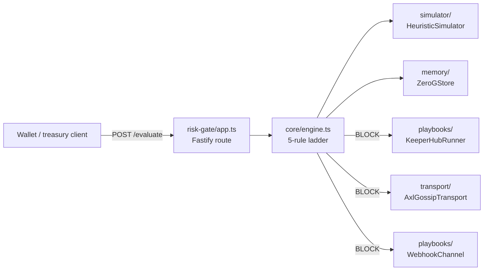

# `src/` — ChainShield server

> Fastify HTTP API that evaluates transaction intents against a deterministic policy engine, anchors every decision on 0G Storage, fires KeeperHub remediation on `BLOCK`, and gossips the verdict over the Gensyn AXL mesh.

The whole server is plain TypeScript on Bun. Five trait-shaped seams (`Store`, `Simulator`, `PlaybookRunner`, `NotificationChannel`, `GossipTransport`) keep every external dependency replaceable — tests run against in-memory fakes; production wires real adapters from env.

| Folder | What it is |
|---|---|
| [`core/`](./core) | Types, Zod schemas, `PolicyService`, `DecisionEngine`, EVM selector helpers |
| [`memory/`](./memory) | `Store` interface, `InMemoryStore`, `ZeroGStore` (0G anchor adapter) |
| [`simulator/`](./simulator) | `Simulator` interface + `HeuristicSimulator` (ERC-20 calldata decode + balance projection) |
| [`playbooks/`](./playbooks) | `PlaybookRunner` interface, `KeeperHubRunner`, `WebhookChannel`, `CollectorChannel` |
| [`transport/`](./transport) | `GossipTransport` interface, `AxlGossipTransport`, `NoopGossip` |
| [`risk-gate/`](./risk-gate) | Fastify `app.ts` + `server.ts` composition root |
| [`cli/`](./cli) | `demo.ts` — four canonical scenes against the live API |

## Request flow

## Hard rules

1. Verdict ladder is monotonic: `BLOCK > REQUIRE_HUMAN_CONFIRMATION > ALLOW`. A rule may only escalate, never de-escalate.
2. `forbiddenSelectors` is checked before any other rule and short-circuits to `BLOCK` with risk 95.
3. Defensive guards (`invalidIntentValue`, `invalidApprovalCap`) escalate to `REQUIRE_HUMAN_CONFIRMATION` (risk 70) instead of throwing.
4. Every decision is persisted via `Store.appendDecision` exactly once.
5. `reasons[]` is human-readable English; `rulesMatched[]` is machine-readable rule keys. Keep them in sync.
6. Sponsor adapters fail soft — a Galileo hiccup or KeeperHub outage never returns 5xx.

## Related

| | |
|---|---|
| Tests | [`../tests/`](../tests) — 114 specs across 13 files |
| Composition root | [`risk-gate/server.ts`](./risk-gate/server.ts) |
| Frontend | [`../web/`](../web) — Astro 6, separate Bun workspace |
| Conventions | [`../AGENTS.md`](../AGENTS.md) |
