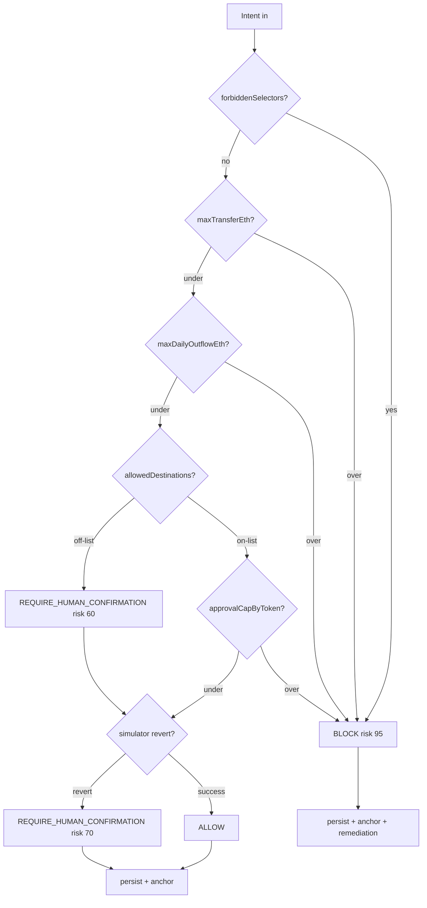

# `src/core/` — types, schemas, engine

> The heart of ChainShield. Pure TypeScript with no I/O — every external dependency is injected as a trait so the engine stays unit-testable in microseconds.

| File | Role |
|---|---|
| [`types.ts`](./types.ts) | All exported types: `TxIntent`, `Policy`, `Decision`, `Verdict`, `SimulationResult`, `BalanceDelta`, `ApprovalDelta`, `PlaybookRun`, `LlmReasoning` |
| [`schemas.ts`](./schemas.ts) | Zod schemas at the API boundary — `policyInputSchema`, `evaluateRequestSchema`. Parsed once at the edge; plain TS types flow through internals |
| [`policyService.ts`](./policyService.ts) | Policy CRUD with version bumping. Zod-validates input, persists to `Store`, returns the canonical record |
| [`engine.ts`](./engine.ts) | `DecisionEngine` — the 5-rule ladder + simulator integration + remediation dispatch |
| [`selectors.ts`](./selectors.ts) | EVM 4-byte selector helpers (`selectorOf`, `decodeUint256`) + curated selector constants (`ERC20_APPROVE`, `ERC20_TRANSFER`, …) |

## Decision ladder

## Invariants (do not break)

1. The verdict ladder is **monotonic** — rules can only escalate.
2. `forbiddenSelectors` short-circuits before any other rule.
3. `maxTransferEth` and `approvalCapByToken` produce `BLOCK` with risk ≥ 90.
4. `maxDailyOutflowEth` reads the timeline; only non-blocked rows count toward the rolling sum.
5. `allowedDestinations` downgrades `ALLOW` to `REQUIRE_HUMAN_CONFIRMATION` (risk 60). It cannot promote to `BLOCK` on its own.
6. Defensive guards escalate to `REQUIRE_HUMAN_CONFIRMATION` instead of throwing.
7. `reasons[]` and `rulesMatched[]` stay in sync.

## Tests

| | |
|---|---|
| 5-rule ladder + guards | [`../../tests/engine.test.ts`](../../tests/engine.test.ts) |
| Simulator integration + revert escalation | [`../../tests/engineSimulation.test.ts`](../../tests/engineSimulation.test.ts) |
| Playbook + notifications + AXL gossip on `BLOCK` | [`../../tests/engineRemediation.test.ts`](../../tests/engineRemediation.test.ts) |
| Policy CRUD + version bumping | [`../../tests/policyService.test.ts`](../../tests/policyService.test.ts) |

## Pointers

| | |
|---|---|
| Parent | [`../README.md`](../README.md) |
| Wired by | [`../risk-gate/server.ts`](../risk-gate/server.ts) |
| Selector reference | [`../../.claude/skills/selector-decode/SKILL.md`](../../.claude/skills/selector-decode/SKILL.md) |
