# `src/memory/` — Store layer

> Pluggable persistence behind a single trait. Tests use the in-memory impl; production wires the 0G anchor adapter.

| File | Role |
|---|---|
| [`store.ts`](./store.ts) | The `Store` interface (`putPolicy`, `getPolicy`, `listPolicies`, `appendDecision`, `listDecisions`, optional `getAnchor`) and the `AnchorRecord` type |
| [`memoryStore.ts`](./memoryStore.ts) | `InMemoryStore` — pure in-process maps + arrays. Used in tests and as the fallback when `ZERO_G_PRIVATE_KEY` is unset |
| [`zeroGStore.ts`](./zeroGStore.ts) | `ZeroGStore` — uploads each policy and decision JSON to 0G Galileo via `@0gfoundation/0g-storage-ts-sdk`, caches the local copy, exposes anchor `(rootHash, txHash)` per id |

## Anchor flow

```mermaid
flowchart LR
    PS[PolicyService.put] --> ZG[ZeroGStore.putPolicy]
    ZG -->|in-memory write returns ~50ms| Caller
    ZG -.->|background| Sched[scheduleAnchor]
    Sched --> Try[tryAnchor]
    Try --> SDK["Indexer.upload(MemData(json))"]
    SDK --> Galileo[(0G Galileo<br/>storage indexer)]
    Galileo -->|"&#123;rootHash, txHash&#125;"| Anchors[(anchors map)]
    Anchors --> Get[getAnchor by id]
```

## Soft-failure contract

- `Indexer.upload` returns either an error-tuple `[result, Error|null]` or throws — `tryAnchor` handles both paths.
- Two response shapes: single `{ rootHash, txHash, txSeq }` and fragmented `{ rootHashes[], txHashes[], txSeqs[] }` (>4 GB). `tryAnchor` normalises both.
- Failure is logged (`logger.warn`) and the anchor map simply lacks an entry — the API still serves the response with `anchor: null`.
- Background uploads never block the API hot path; tests use the optional `waitForAnchor(id)` helper to settle pending uploads deterministically.

## Tests

| | |
|---|---|
| Anchor on write, soft-failure, empty-result handling | [`../../tests/zeroGStore.test.ts`](../../tests/zeroGStore.test.ts) |
| Anchor surfacing on policy + decision API responses (real `ZeroGStore` + `buildApp` e2e) | [`../../tests/apiAnchor.test.ts`](../../tests/apiAnchor.test.ts) |
| Multi-tenant decision isolation by client id | [`../../tests/clientIsolation.test.ts`](../../tests/clientIsolation.test.ts) |

## Live proof

A real policy was anchored on Galileo testnet — see the rootHash + storage tx table at the top of [`../../README.md`](../../README.md).

## Pointers

| | |
|---|---|
| Parent | [`../README.md`](../README.md) |
| Wired by | [`../risk-gate/server.ts`](../risk-gate/server.ts) — picks `ZeroGStore` when `ZERO_G_PRIVATE_KEY` is set |
| Sponsor research | [`../../docs/sponsors/0g.md`](../../docs/sponsors/0g.md) |
