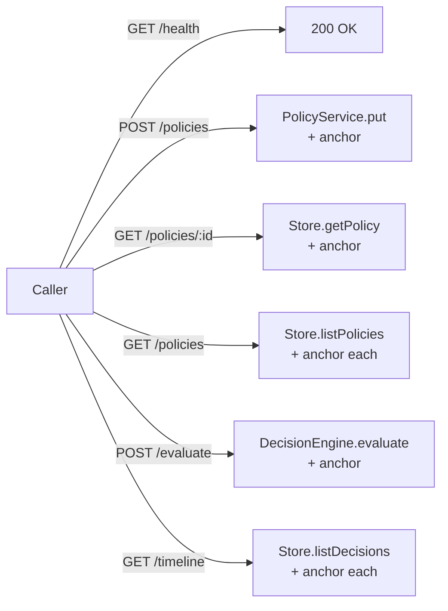

# `src/risk-gate/` — Fastify API + composition root

> The HTTP surface and the wiring that decides which adapter to use for each trait. Reads env vars once at boot, swaps real adapters in place of the in-memory fallbacks, and starts listening.

| File | Role |
|---|---|
| [`app.ts`](./app.ts) | `buildApp(deps)` — Fastify instance, CORS layer, Zod-validated routes for `/policies`, `/policies/:id`, `/evaluate`, `/timeline`, `/health`. Anchor metadata is injected at the serialization boundary by `withAnchorPolicy` / `withAnchorDecision` |
| [`server.ts`](./server.ts) | The composition root — reads env, picks `Store` / `PlaybookRunner` / `GossipTransport`, registers notification channels, calls `defaultEngine`, starts listening on `:8787` |

## Adapter selection

| Env var | When set | Real adapter | When unset | Fallback |
|---|---|---|---|---|
| `ZERO_G_PRIVATE_KEY` | non-empty | `ZeroGStore` (anchors on Galileo) | unset | `InMemoryStore` |
| `KEEPERHUB_API_KEY` | non-empty | `KeeperHubRunner` (real workflows) | unset | `MockRunner` |
| `NOTIFY_DISCORD_WEBHOOK` | set | adds `discord` channel via `WebhookChannel` | unset | only `collector` channel registered |
| `AXL_BASE_URL` | non-empty | `AxlGossipTransport` (publish over mesh) | unset | `NoopGossip` |
| `WEB_ORIGIN` | comma list | parsed via `parseOriginEntry` (literal or `/regex/`) | unset | defaults to `http://127.0.0.1:4321,http://localhost:4321` |

## Routes



## Anchor injection

`ZeroGStore.getAnchor(id)` is **optional** on the `Store` interface. `app.ts` calls it via optional chaining, so `InMemoryStore` (which has no anchor concept) needs no changes — the API simply omits the `anchor` field.

```ts
// inside app.ts
function withAnchorDecision(d: Decision): WithAnchor<Decision> {
  const anchor = store.getAnchor?.(d.id);
  return anchor ? { ...d, anchor } : d;
}
```

## Tests

| | |
|---|---|
| End-to-end API flow against an in-memory store | [`../../tests/api.test.ts`](../../tests/api.test.ts) |
| Anchor surfacing on policy + decision responses (real `ZeroGStore` + `buildApp`) | [`../../tests/apiAnchor.test.ts`](../../tests/apiAnchor.test.ts) |
| CORS allowlist + Cloudflare Pages preview-domain regex | [`../../tests/cors.test.ts`](../../tests/cors.test.ts) |

## Pointers

| | |
|---|---|
| Parent | [`../README.md`](../README.md) |
| Engine | [`../core/engine.ts`](../core/engine.ts) |
| Frontend that calls these routes | [`../../web/`](../../web) |
| Containerised deploy | [`../../Dockerfile`](../../Dockerfile), [`../../docker-compose.yml`](../../docker-compose.yml) |
| $0 hosting walkthrough | [`../../docs/deploy.md`](../../docs/deploy.md) |
