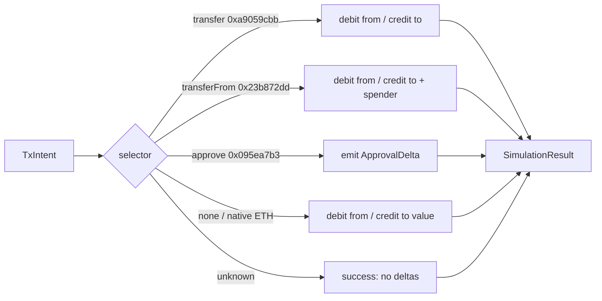

# `src/simulator/` — pre-signature simulation

> A heuristic ERC-20 simulator that decodes calldata locally and projects balance deltas without a network round trip. Returns a result in microseconds, so the engine can escalate borderline intents without a fork.

| File | Role |
|---|---|
| [`simulator.ts`](./simulator.ts) | The `Simulator` interface — `simulate(intent)` returning a `SimulationResult` (`success`, `revertReason?`, `balanceDeltas[]`, `approvals[]?`, `gasUsed?`) |
| [`heuristic.ts`](./heuristic.ts) | `HeuristicSimulator` — decodes `transfer` / `transferFrom` / `approve` calldata and projects deltas; treats native ETH and unknown selectors as success |

## What it covers

## Why heuristic, not fork

| | Fork-based simulator | Heuristic simulator |
|---|---|---|
| Round trip | `eth_call` against fork (~hundreds of ms) | None — pure calldata decode |
| Coverage | Whole EVM | ERC-20 transfer / transferFrom / approve + native ETH |
| Edge cases | Fee-on-transfer, blacklists, pause | Caught by the `forbiddenSelectors` rule before the simulator runs |
| Cost | RPC fees + node maintenance | Free |
| Latency budget | Out of scope for hot-path API | Microseconds — fits inside the `~50 ms` API target |

The simulator is one of six rules in the engine ladder; `forbiddenSelectors` already blocks the dangerous tokens, so the heuristic only needs to model the happy paths well.

## Tests

| | |
|---|---|
| Calldata decode + balance deltas + typed `approvals[]` | [`../../tests/simulator.test.ts`](../../tests/simulator.test.ts) |
| Engine integration + revert escalation | [`../../tests/engineSimulation.test.ts`](../../tests/engineSimulation.test.ts) |

## Pointers

| | |
|---|---|
| Parent | [`../README.md`](../README.md) |
| Consumed by | [`../core/engine.ts`](../core/engine.ts) — `runSimulator()` |
| Selector reference | [`../core/selectors.ts`](../core/selectors.ts) |
