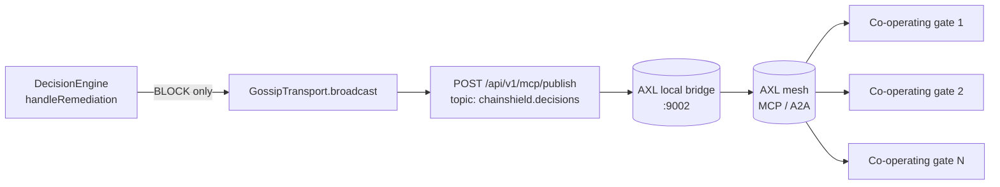

# `src/transport/` — peer-to-peer decision gossip

> When ChainShield issues a `BLOCK`, the verdict needs to reach every co-operating gate without a centralised relay. This folder publishes each blocked decision over the Gensyn AXL agent mesh — soft-failure, no SDK lock-in, language-agnostic.

| File | Role |
|---|---|
| [`axlGossip.ts`](./axlGossip.ts) | `AxlGossipTransport` — `POST ${AXL_BASE_URL}/api/v1/mcp/publish` with a `{ topic, payload: { decision, policy } }` body. Default topic `chainshield.decisions` |
| [`noopGossip.ts`](./noopGossip.ts) | `NoopGossip` — used when `AXL_BASE_URL` is unset, so the rest of the system behaves identically without an AXL node running |

## Gossip flow

## Why AXL

- **Local HTTP bridge at `:9002`** — language-agnostic, no SDK, drop-in for any agent stack.
- **Built-in MCP / A2A support** — structured agent-to-agent messages without re-implementing libp2p.
- **No central relay** — co-operating gates form a mesh; one offline node never breaks the rest.
- **NAT/firewall friendly + end-to-end encrypted** by default.

## Soft-failure contract

`GossipTransport.broadcast` is required to **never throw**. Implementations log internally on failure and return. The engine awaits the call so blocked decisions reach the mesh before the API response returns; because the contract guarantees no throws, this awaiting is safe.

| Failure mode | Behaviour |
|---|---|
| 5xx response | `logger.warn` with status + summarised body; no throw |
| Network error (`ECONNREFUSED`, DNS, etc.) | `logger.warn` with the truncated message; no throw |
| HTML error page in the body | Collapsed to `(html error page)` so markup never reaches the logs |
| Oversized JSON error body | Truncated to 200 chars + `…` |

## Tests

| | |
|---|---|
| Happy path, default + custom topic, soft-failure on 5xx, soft-failure on network error, HTML scrubbing, `NoopGossip` no-op | [`../../tests/axlGossip.test.ts`](../../tests/axlGossip.test.ts) |
| Engine integration: gossip fires on `BLOCK`, never on `ALLOW` / `REQUIRE_HUMAN_CONFIRMATION` | [`../../tests/engineRemediation.test.ts`](../../tests/engineRemediation.test.ts) |

## Pointers

| | |
|---|---|
| Parent | [`../README.md`](../README.md) |
| Wired by | [`../risk-gate/server.ts`](../risk-gate/server.ts) — picks `AxlGossipTransport` when `AXL_BASE_URL` is set, else `NoopGossip` |
| Engine hook | [`../core/engine.ts`](../core/engine.ts) — broadcast invoked from `handleRemediation` after the playbook runner |
| Sponsor research | [`../../docs/sponsors/gensyn-axl.md`](../../docs/sponsors/gensyn-axl.md) |
| AXL docs | <https://docs.gensyn.ai/tech/agent-exchange-layer> |
